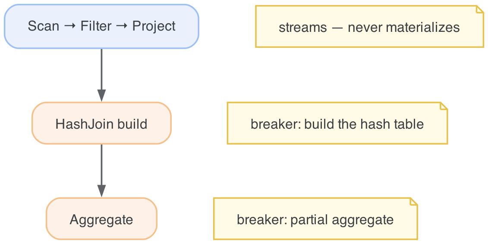

# Execution model

Batcher runs across two planes. Python is the control plane: it builds a plan,
optimizes it, and decides resource bounds, but never touches a row in the hot path.
Rust is the data plane, where every per-row and per-batch computation runs over
Apache Arrow. The two meet at a single boundary, a JSON plan IR plus zero-copy
Arrow `RecordBatch`es (the Arrow C Data Interface), and nothing else crosses it.
The Python entry point is Core handing the plan to the native engine:

```python
out, metrics = _native.execute_plan_metered(plan.to_json(), sources, cfg.engine_config_json())
```

This page is the architecture-level view. For the engine's internals, the tiers,
the morsel loop, and the runtime primitives, see
[Execution engine](../internals/execution.md).

## Lazy evaluation

The API is lazy and immutable. Each operation returns a new `Dataset` wrapping a
`LogicalPlan`; nothing computes until a terminal call.

```python
import batcher as bt

ds = bt.read("data.parquet")
filtered = ds.filter(bt.col("x") > 0)
result = filtered.select("x", "y")  # still no execution

rows = result.collect()  # the plan runs here
```

Deferring work until the terminal op is what makes whole-query optimization
possible: by `collect`, the optimizer sees the entire computation and can push
predicates and projections down, fuse operators, and choose join orders before a
single batch is read. It is also what makes adaptive re-optimization mid-query
possible: there is one plan to revise, not a sequence of already-executed steps.

The terminal operations are `collect()` (returns a PyArrow `Table`),
`to_pydict()`, `count()`, `iter_batches()` for streaming a result without
materializing it whole, and the `write` namespace (`ds.write("out/")` or a typed
form like `ds.write.parquet(...)`). To see the optimized plan without running it,
call `explain()`:

```python
print(ds.filter(bt.col("x") > 10).select("a", "b").explain())
```

## Pipelines and breakers

Execution lowers a plan into pipelines and breakers. A pipeline is a maximal chain
of operators that streams a batch straight through without materializing: scan,
filter, project, probe. A breaker is an operator that must collect its input before
it can produce output: a hash-join build, an aggregate, a sort, a distinct, a
window.



Breakers are the load-bearing points of the model. Data materializes there, spills
there under memory pressure, shuffles there when a query is distributed, and gets
re-optimized there once real numbers are known. The unit of work flowing through a
pipeline is the morsel, a `RecordBatch` of 16,384 rows by default, which keeps
scheduling granular and the working set in cache.

## Execution paths

There is one set of operator semantics, exercised by three paths. The Tier-0
sequential interpreter is the reference. It is deterministic and kept obviously
correct, and the other two paths are tested against it.

Tier-0 parallel reuses the same operator code and changes only the scheduling. It
morselizes, runs on a rayon thread pool, and hash-shuffles into the breakers,
computing exactly what the sequential path does. Tier-1 is the Cranelift JIT: it
compiles the supported subset of column expressions to machine code once per
operator and reuses that across every morsel. On anything it does not support, the
JIT falls back to the interpreter rather than diverge, so it is bit-for-bit
identical to the interpreter on its subset.

A compiled pipeline can drop back to the interpreter at any breaker, which is what
lets compilation and adaptivity coexist.

## One algebra, single node to cluster

Stateful operators are written once as mergeable primitives: `partial(batch)`
builds a partial state, `combine(states)` merges two of them, and `finalize(state)`
emits rows. Because `combine` is associative and commutative, partials merge in any
order. That single implementation serves one core (the sequential interpreter),
many cores (the parallel path builds partials and combines them), and many machines
(the distributed path composes the same `partial` / `combine` / `finalize`). There
is no separate distributed operator with its own semantics, so a result is identical
whether it runs on a laptop or a cluster — CI asserts exactly that.

## Adaptive re-optimization

This is the part static engines cannot match. At a breaker, the engine has
*measured* the data it just processed: real row counts, real operator times, real
peak memory, rather than estimated it. Core records those numbers, and when an
estimate was off by more than about 2x, Kyber re-plans the rest of the query on the
measured values before continuing. DuckDB optimizes once before it runs; Spark AQE
adapts only at stage boundaries; Batcher adapts at every breaker.

## Memory and spilling

Carbonite owns the memory envelope. It throttles new allocations as the budget
fills and begins spilling to disk before it is exhausted. Aggregation, join, and
sort all spill, so a query that does not fit in memory slows down rather than
failing. Spilling is a property of the runtime primitive, not a separate operator —
the plan does not change when a query goes out of core.

## Distribution

Ray is an optional dependency, used for task and actor scheduling and control-plane
metadata only; single-node execution never loads it. On a cluster, each worker
hosts the same in-process Rust engine, and bulk Arrow batches move between workers
over Arrow Flight (`bc-transport`) with credit-based flow control: one credit is
one in-flight batch slot, and a producer blocks when its credits reach zero. The
batches bypass the Ray object store entirely, which is where the serialization
overhead and OOM risk of object-store shuffles would otherwise come from. The
radix-partition-and-spill machinery that does single-node out-of-core also becomes
the distributed shuffle; disk and network are two sinks for one mechanism.

## See also

- [Execution engine](../internals/execution.md) — pipelines, morsels, and the tiers in detail
- [Architecture overview](overview.md) — the two planes and the control-plane subsystems
- [Configuration options](../configuration/options.md) — every execution knob
