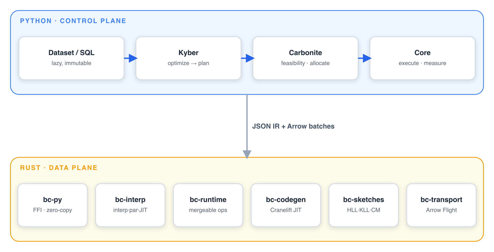

# Architecture

How a query flows from the Python control plane to the Rust data plane. Python builds
and optimizes the plan but never touches a row; Rust runs every per-row operation over
Apache Arrow. They meet at one typed, zero-copy boundary — which is also why a result
is identical on one core or a hundred.



:::{seealso}
This section is the shape of the system. For one mechanism at a time — how the JIT falls
back, how a morsel is scheduled, how the shuffle blocks a producer at zero credits — see
the [deep dives](../deep-dives/index.md).
:::

::::{grid} 1 3 3 3
:gutter: 3

:::{grid-item-card} {octicon}`stack;1.1em` Overview
:link: overview
:link-type: doc
The two planes, the crate layout, and how they fit together.
:::

:::{grid-item-card} {octicon}`workflow;1.1em` Execution
:link: execution
:link-type: doc
Morsels, the interpreter and JIT tiers, and the parallel scheduler.
:::

:::{grid-item-card} {octicon}`git-branch;1.1em` Optimization
:link: optimization
:link-type: doc
Kyber's passes, cost-based choices, and adaptive re-optimization.
:::
::::

```{toctree}
:hidden:

overview
execution
optimization
fault-tolerance
```
