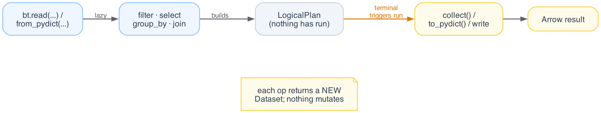

# Core concepts

Batcher splits cleanly into a Python control plane and a Rust data plane. Python
builds and optimizes a query plan; Rust runs it over Apache Arrow record batches.
Understanding that split, and the lazy Dataset model that rides on top of it,
explains how the rest of the API behaves.

## A Dataset is a handle to a plan

A `Dataset` does not hold data. It is a handle to a logical plan plus its bound
inputs. Every operation returns a new `Dataset`; nothing is mutated in place.

```python
import batcher as bt

ds = bt.from_pydict({"x": [1, 2, 3, 4], "g": ["a", "b", "a", "b"]})

filtered = ds.filter(bt.col("x") > 1)     # ds is unchanged
projected = filtered.select("x")          # filtered is unchanged

print(ds.columns)
# ['x', 'g']
```

Because datasets are immutable, you can branch a pipeline from any intermediate
handle and reuse it without copying data.

## Expressions run in Rust

Column work is expressed with `Expr` values built from {py:obj}`bt.col(...) <batcher.col>` and {py:obj}`bt.lit(...) <batcher.lit>`.
An expression is a description, not a Python loop. When the plan executes, the
expression is evaluated in the Rust data plane over whole Arrow batches, never row
by row in Python.

```python
total = bt.col("x") * bt.lit(10)
print(ds.select(scaled=total).to_pydict())
# {'scaled': [10, 20, 30, 40]}
```

This is why there are no per-row Python callbacks in the hot path: the control
plane never touches a tuple. The only place user Python sees data is
`map_batches`, which operates on whole Arrow batches.

## Terminal operations trigger execution

Operations are lazy. The plan is built up as you chain calls, and the optimizer
runs only when you call a terminal operation.



The common terminals are:

- `to_pydict()` - a column-oriented dict.
- `to_pylist()` - a list of row dicts.
- `collect()` - a `pyarrow.Table`.
- `count()` - the row count.
- `iter_batches()` - an iterator of Arrow record batches.
- `write.parquet(...)`, `write.csv(...)`, `write.json(...)`, `write(...)`.

```python
plan = ds.filter(bt.col("x") >= 2).select("x")   # nothing runs yet
print(plan.to_pydict())                            # runs here
# {'x': [2, 3, 4]}
```

`explain()` returns the optimized plan as text without executing it, which is
useful for confirming what the optimizer did.

```python
print(plan.explain())
```

## Single node equals distributed via mergeable algebra

Stateful operators (aggregation, join, distinct, window) are written once as
mergeable primitives: a `partial` step builds partition-local state, `combine`
merges states associatively, and `finalize` produces rows. The same
implementation runs on one core, many cores, or many machines. A distributed run
is a scheduling concern, not a second set of semantics, so a result is identical
whether it is produced on a laptop or a cluster.


```python
counts = ds.group_by("g").agg(n=bt.count()).sort("g")
print(counts.to_pydict())
# {'g': ['a', 'b'], 'n': [2, 2]}
```

Passing `distributed=True` to `collect()` runs the same plan across workers; the
output matches the single-node result above.

## Adaptive re-optimization

The optimizer (Kyber) does not optimize once and commit. At pipeline breakers
(sort, aggregate, join build), the engine measures the actual cardinalities it
just produced and feeds them back, so the remainder of the plan can be re-planned
on real numbers rather than static estimates. DuckDB optimizes a single time
before execution; Spark adapts only at stage boundaries. Continuous re-optimization
inside a query is what lets Batcher correct a bad estimate while the query is still
running.

## Where to go next

- [Reading data](../user-guide/reading-data.md): every way to build a dataset.
- [Transformations](../user-guide/transformations.md),
  [Filtering](../user-guide/filtering.md),
  [Aggregations](../user-guide/aggregations.md),
  [Joins](../user-guide/joins.md),
  [Window functions](../user-guide/window-functions.md).
