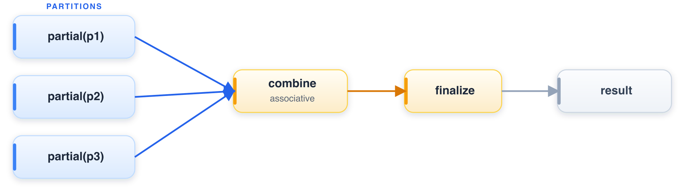

# One core to a cluster

Stateful operators — aggregation, join, distinct, window — are written once as
*mergeable* primitives: a `partial` step builds partition-local state, `combine`
merges those states associatively, and `finalize` produces rows. Because `combine`
is associative and commutative, partials merge in any order.



The same implementation serves one core, many cores (the parallel executor
morselizes and merges), and many machines (the distributed path partitions, runs the
partials, and combines). A distributed run is a *scheduling* concern, not a second
set of semantics, so a result is identical whether it is produced on a laptop or a
cluster — and per-node memory stays bounded because partials spill to disk.

```python
import batcher as bt

ds = bt.from_pydict({"x": [1, 2, 3, 4], "g": ["a", "b", "a", "b"]})

counts = ds.group_by("g").agg(n=bt.count()).sort("g")
print(counts.to_pydict())
# {'g': ['a', 'b'], 'n': [2, 2]}
```

Passing `distributed=True` to `collect()` runs the same plan across workers; the
output matches the single-node result above. There is no separate distributed
operator to learn — going from a sample to petabytes is a deployment change, not a
rewrite.
