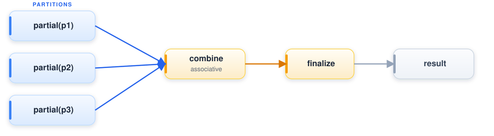

# One core to a cluster

Aggregation, join, distinct, and window all carry state across rows. Each of them
is written exactly once, as a *mergeable* primitive: a `partial` step builds
partition-local state, `combine` merges those states associatively, and `finalize`
produces rows. `combine` is associative and commutative, so partials merge in any order.



That one implementation then serves a single core, many cores, and many machines. On
many cores the parallel executor morselizes the input and merges the partials. On many
machines the distributed path partitions the data, runs the partials, and combines them.

Distribution is a *scheduling* concern rather than a second set of semantics. A result
is identical whether a laptop or a cluster produced it.

```python
import batcher as bt

ds = bt.from_pydict({"x": [1, 2, 3, 4], "g": ["a", "b", "a", "b"]})

counts = ds.group_by("g").agg(n=bt.count()).sort("g")
print(counts.to_pydict())
# {'g': ['a', 'b'], 'n': [2, 2]}
```

Passing `distributed=True` to `collect()` runs that same plan across workers, and the
output matches the single-node result above. There is no separate distributed operator
to learn. Going from a sample to petabytes is a deployment change, not a rewrite of your
query.

The mergeable form is also what bounds memory: each `partial` stays small, and a
partition that grows too large spills to disk instead of failing. So scaling out is a
flag. The plan and the result don't change.

```python
# docs: skip
counts.collect(distributed=True)   # same plan, many machines, identical result
```


## See also

- {doc}`../../user-guide/performance`: measuring and tuning before reaching for more machines.
- {doc}`../../deep-dives/mergeable-algebra`: the `partial`, `combine`, `finalize` contract in full.
- {doc}`../../integrations/ray`: running the distributed path on a real cluster.
