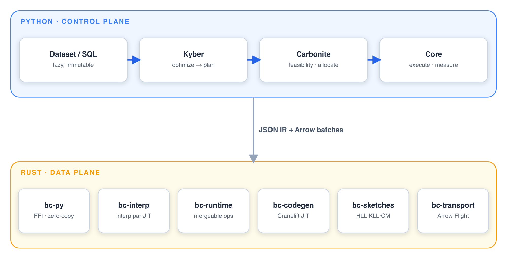

# Batcher

```{raw} html
<div class="bt-hero">
  <p class="bt-hero-eyebrow">JIT &middot; Adaptive &middot; Arrow-native</p>
  <p class="bt-hero-tagline">One data engine, from your laptop to your cluster.</p>
  <p class="bt-hero-sub">
    Batcher runs SQL, DataFrame, and ML workloads on one engine that tunes itself as
    the query runs. Prototype on your laptop and ship the same code to a cluster &mdash;
    sub-second on small data, bounded-memory at petabyte scale, no rewrite in between.
  </p>
  <p class="bt-hero-cta">
    <a class="bt-btn bt-btn-primary" href="getting-started/index.html">Get started</a>
    <a class="bt-btn" href="getting-started/quickstart.html">Quickstart</a>
    <a class="bt-btn" href="https://github.com/stephenoffer/batcher">GitHub</a>
  </p>
</div>
```

Most engines plan a query once, before they have seen a single row, then commit to
that plan whatever the data turns out to be. Batcher measures the data as it flows
and re-plans the rest of the query on real numbers, so a query that starts on a bad
estimate corrects itself mid-flight.

## What you get

::::{grid} 1 2 2 2
:gutter: 3

:::{grid-item-card} {octicon}`shield;1.1em` Bad estimates don't sink the query
Most engines pick a plan before seeing a row, then run it to the end even when the
data turns out different, the classic cause of a job that stalls or runs out of
memory. Batcher re-plans mid-query on the row counts it just measured, so a query
that started on a wrong guess corrects itself instead of failing.
:::

:::{grid-item-card} {octicon}`server;1.1em` Scale without a rewrite
Prototype on a sample on your laptop, then point the same code at the full dataset on
a cluster. Operators are written once and combine across cores and machines, so
growing from megabytes to petabytes is a deployment change, and memory stays bounded
because every stage can spill to disk.
:::

:::{grid-item-card} {octicon}`zap;1.1em` Fast without hand-tuning
Column math compiles to machine code and streams in cache-sized batches, so small
queries stay sub-second and large ones stay efficient. You don't tune batch sizes or
partition counts to get there; the engine adapts them as it runs.
:::

:::{grid-item-card} {octicon}`stack;1.1em` One engine, not a stack
SQL, DataFrames, and ML inference run on the same engine over the same Arrow data, so
you stop gluing a query tool to a dataframe library to a serving system — and the
seams between them stop leaking.
:::
::::

## The same query, two ways

Write it as a DataFrame pipeline or as SQL. Both build the same plan and run on the
same engine.

::::{tab-set}
:::{tab-item} DataFrame
```python
import batcher as bt

sales = bt.from_pydict(
    {
        "category": ["a", "b", "a", "b", "a"],
        "price": [10.0, 20.0, 30.0, 40.0, 50.0],
        "qty": [1, 2, 3, 4, 5],
    }
)

revenue = (
    sales.with_columns(total=bt.col("price") * bt.col("qty"))
    .group_by("category")
    .agg(revenue=bt.col("total").sum())
    .sort("revenue", descending=True)
)
print(revenue.to_pydict())
# {'category': ['a', 'b'], 'revenue': [350.0, 200.0]}
```
:::

:::{tab-item} SQL
```python
import batcher as bt

sales = bt.from_pydict(
    {
        "category": ["a", "b", "a", "b", "a"],
        "price": [10.0, 20.0, 30.0, 40.0, 50.0],
        "qty": [1, 2, 3, 4, 5],
    }
)

revenue = bt.sql(
    "SELECT category, SUM(price * qty) AS revenue "
    "FROM sales GROUP BY category ORDER BY revenue DESC",
    sales=sales,
)
print(revenue.to_pydict())
# {'category': ['a', 'b'], 'revenue': [350.0, 200.0]}
```
:::
::::

Files and object stores use the same API. Only the source changes.

```python
# docs: skip
ds = bt.read("s3://bucket/events.parquet")
ds.filter(bt.col("status") == "active").write.parquet("output/active.parquet")
```

## How it works

That mix of Python ergonomics and native speed comes from a clean split.
Python builds and optimizes the plan but never touches a row; every per-row operation
runs in Rust over Apache Arrow. They meet at one typed boundary, which is also why a
result is identical whether the query runs on one core or a hundred: there is a single
engine underneath, not a fast local path bolted to a separate distributed one.



## How it compares

| Reach for Batcher when | Because |
| --- | --- |
| You outgrow DuckDB's single node | the same query scales out, and re-optimizes mid-flight rather than planning once |
| Polars is fast but stops at one machine | the mergeable algebra runs the same code on a cluster |
| Spark's overhead dominates small jobs | it runs in-process locally, with no cluster to spin up |

Speed is measured correctness-first: the benchmark harness refuses to time a query
whose result does not match DuckDB, and every operator is differential-tested against
it. The numbers live in [`benchmarks/`](https://github.com/stephenoffer/batcher/tree/main/benchmarks).

## Where to go next

::::{grid} 1 2 2 3
:gutter: 3

:::{grid-item-card} {octicon}`rocket;1.1em` Getting started
:link: getting-started/index
:link-type: doc
Install, run a first pipeline, and learn the lazy execution model.
:::

:::{grid-item-card} {octicon}`book;1.1em` Tutorials
:link: tutorials/index
:link-type: doc
Worked, end-to-end walkthroughs you can run as written.
:::

:::{grid-item-card} {octicon}`code;1.1em` User guide
:link: user-guide/index
:link-type: doc
Task-oriented guides for every part of the Dataset API.
:::

:::{grid-item-card} {octicon}`list-unordered;1.1em` API reference
:link: api/index
:link-type: doc
Every public class and function, generated from the docstrings.
:::

:::{grid-item-card} {octicon}`beaker;1.1em` Machine learning
:link: ml/index
:link-type: doc
Batch inference, embeddings, and training-data loaders.
:::

:::{grid-item-card} {octicon}`gear;1.1em` Configuration
:link: configuration/index
:link-type: doc
Memory, spill, parallelism, and the adaptive knobs.
:::
::::

```{toctree}
:hidden:
:caption: Learn

getting-started/index
tutorials/index
learning-paths/index
```

```{toctree}
:hidden:
:caption: Guides

user-guide/index
ml/index
configuration/index
migration/index
```

```{toctree}
:hidden:
:caption: Reference

api/index
```

```{toctree}
:hidden:
:caption: Design

architecture/index
internals/index
```
