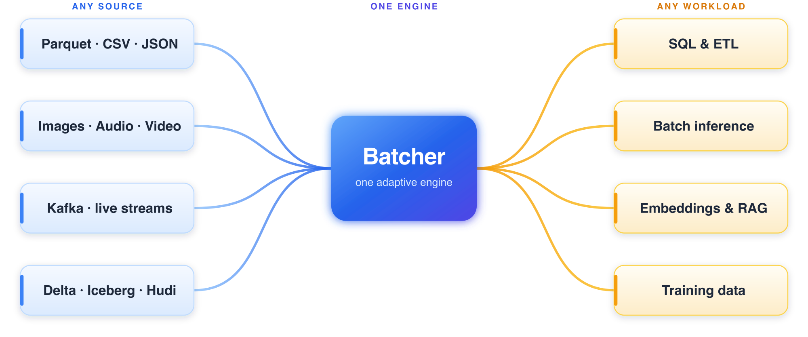

# Batcher

```{raw} html
<div class="bt-hero">
  <p class="bt-hero-eyebrow">Any data &middot; Any AI workload &middot; Batch &amp; streaming</p>
  <p class="bt-hero-tagline">One engine for every kind of data, and every kind of AI.</p>
  <p class="bt-hero-sub">
    Structured tables, unstructured text, images, audio, video. SQL, DataFrames, and
    expressions. Batch jobs and live streams. Batcher runs all of it on a single
    engine &mdash; from a laptop to a cluster &mdash; and tunes itself as the query runs.
  </p>
  <p class="bt-hero-cta">
    <a class="bt-btn bt-btn-primary" href="getting-started/index.html">Get started</a>
    <a class="bt-btn" href="getting-started/quickstart.html">Quickstart</a>
    <a class="bt-btn" href="https://github.com/stephenoffer/batcher">GitHub</a>
  </p>
</div>
```

Data work has splintered into a tool per job: one for SQL, another for DataFrames, a
third for streaming, more for images and models. Each one is another system to run
and another seam to leak. Batcher collapses that stack into a single engine.



## Why Batcher

The tools we reach for each stop somewhere, and the gaps between them are where the
time goes:

::::{grid} 1 3 3 3
:gutter: 3

:::{grid-item-card} {octicon}`git-branch;1.1em` Outgrow it, rewrite it
A fast single-node engine hits a ceiling. Scaling out means porting the pipeline to a
different system with different semantics.
:::

:::{grid-item-card} {octicon}`stack;1.1em` A tool per job
SQL in one engine, DataFrames in another, separate loaders and servers for ML. Every
hand-off between them is a place for data and effort to leak.
:::

:::{grid-item-card} {octicon}`gear;1.1em` Tuned by hand
Batch sizes, partition counts, join order — guess wrong and the job stalls or runs out
of memory, often only at scale.
:::
::::

Batcher answers all three at once: the same code from a laptop to a cluster, one
engine across SQL, DataFrames, and ML, and a plan that re-tunes itself as it runs — so
you build the pipeline once and it keeps working as the data grows.

## Any data, any workload

The same engine reads a Parquet table, a folder of images, or a Kafka stream, and the
same pipeline can clean it, query it, or feed it to a model.

::::{grid} 1 2 2 2
:gutter: 3

:::{grid-item-card} {octicon}`table;1.1em` Structured
Parquet, CSV, JSON, and the lakehouse formats (Delta, Iceberg, Hudi) — filtered,
joined, and aggregated with SQL or DataFrames.
:::

:::{grid-item-card} {octicon}`file;1.1em` Unstructured
Text, logs, and documents read whole or by the line, then parsed into clean columns
at scale.
:::

:::{grid-item-card} {octicon}`image;1.1em` Multimodal
Images, audio, and video decoded straight into tensors, so one pipeline can clean a
table and feed a model.
:::

:::{grid-item-card} {octicon}`search;1.1em` Vectors & embeddings
First-class list and tensor columns with the vector ops behind embeddings, similarity
search, and RAG.
:::
::::

## Write it your way

Express a transformation as a DataFrame, as SQL, or as composable expressions — and
run it as a batch job or a live stream. Every form builds the same plan and runs on
the same engine, so you mix them freely.

::::{tab-set}
:::{tab-item} DataFrame
```python
import batcher as bt

sales = bt.from_pydict({"cat": ["a", "b", "a"], "amt": [10.0, 20.0, 30.0]})
revenue = sales.group_by("cat").agg(total=bt.col("amt").sum())
print(revenue.sort("total", descending=True).to_pydict())
# {'cat': ['a', 'b'], 'total': [40.0, 20.0]}
```
:::

:::{tab-item} SQL
```python
import batcher as bt

sales = bt.from_pydict({"cat": ["a", "b", "a"], "amt": [10.0, 20.0, 30.0]})
revenue = bt.sql("SELECT cat, SUM(amt) AS total FROM sales GROUP BY cat", sales=sales)
print(revenue.sort("total", descending=True).to_pydict())
# {'cat': ['a', 'b'], 'total': [40.0, 20.0]}
```
:::

:::{tab-item} Expressions
```python
import batcher as bt

ds = bt.from_pydict({"price": [10.0, 20.0, 30.0], "qty": [1, 2, 3]})
revenue = bt.col("price") * bt.col("qty")            # a value you build once
tier = bt.when(revenue > 40).then(bt.lit("high")).otherwise(bt.lit("low"))
print(ds.select(revenue=revenue, tier=tier).to_pydict())
# {'revenue': [10.0, 40.0, 90.0], 'tier': ['low', 'low', 'high']}
```
:::

:::{tab-item} Streaming
```python
# docs: skip
import batcher as bt

# the same group-by, now over an unbounded source
clicks = bt.read.kafka(topic="clicks")
counts = clicks.group_by("page").agg(n=bt.count())

# batch (default) → micro-batch → continuous: change one argument
counts.write.parquet("out/", trigger=bt.Trigger.processing_time("10s"))
```
:::
::::

Expressions carry typed accessors for every column kind — `.str`, `.dt`, `.list`,
`.struct` — so the column language is the same whether you reach for it from a
DataFrame, from SQL, or in a stream.

## Explore the capabilities

::::{grid} 1 2 3 3
:gutter: 3

:::{grid-item-card} {octicon}`rocket;1.1em` Getting started
:link: getting-started/index
:link-type: doc
Install and run your first pipeline.
:::

:::{grid-item-card} {octicon}`download;1.1em` Reading data
:link: user-guide/reading-data
:link-type: doc
Files, object storage, databases, and streams.
:::

:::{grid-item-card} {octicon}`pencil;1.1em` Transformations
:link: user-guide/transformations
:link-type: doc
Select, derive, reshape, and explode columns.
:::

:::{grid-item-card} {octicon}`filter;1.1em` Filtering
:link: user-guide/filtering
:link-type: doc
Predicates, null handling, and sampling.
:::

:::{grid-item-card} {octicon}`graph;1.1em` Aggregations
:link: user-guide/aggregations
:link-type: doc
Group, summarize, pivot, and roll up.
:::

:::{grid-item-card} {octicon}`git-merge;1.1em` Joins
:link: user-guide/joins
:link-type: doc
Inner, outer, semi, anti, and as-of joins.
:::

:::{grid-item-card} {octicon}`versions;1.1em` Window functions
:link: user-guide/window-functions
:link-type: doc
Ranking, running totals, lag and lead.
:::

:::{grid-item-card} {octicon}`code;1.1em` Expressions
:link: user-guide/expressions
:link-type: doc
The composable column language and its accessors.
:::

:::{grid-item-card} {octicon}`database;1.1em` SQL
:link: user-guide/sql
:link-type: doc
Full SQL that lowers to the same engine.
:::

:::{grid-item-card} {octicon}`broadcast;1.1em` Streaming
:link: user-guide/streaming
:link-type: doc
Watermarks, windows, and exactly-once output.
:::

:::{grid-item-card} {octicon}`beaker;1.1em` Machine learning
:link: ml/index
:link-type: doc
Batch inference, embeddings, and training data.
:::

:::{grid-item-card} {octicon}`cloud;1.1em` Cloud & lakehouse
:link: user-guide/cloud-storage
:link-type: doc
S3, GCS, Azure, and Delta / Iceberg / Hudi.
:::
::::

## It tunes itself

You don't size batches, pick join strategies, or guess partition counts. Batcher
measures the data as it flows and re-plans the rest of the query on real numbers, so a
query that starts on a bad estimate corrects itself instead of stalling — the kind of
mid-flight adaptation a plan-once optimizer can't do. The
[architecture guide](architecture/index.md) covers how, if you're curious.

## How it compares

Each tool stops somewhere; Batcher's aim is the whole range on one engine.

```{raw} html
<table class="bt-matrix">
<thead><tr><th>Capability</th>
<th>Batcher</th>
<th>DuckDB</th>
<th>Polars</th>
<th>Spark</th>
<th>Ray&nbsp;Data</th>
</tr></thead><tbody>
<tr><td>Runs in-process, no cluster</td><td><span class="y">✓</span></td><td><span class="y">✓</span></td><td><span class="y">✓</span></td><td><span class="n">—</span></td><td><span class="n">—</span></td></tr>
<tr><td>Sub-second small queries</td><td><span class="y">✓</span></td><td><span class="y">✓</span></td><td><span class="y">✓</span></td><td><span class="n">—</span></td><td><span class="p">~</span></td></tr>
<tr><td>Scales to a cluster</td><td><span class="y">✓</span></td><td><span class="n">—</span></td><td><span class="n">—</span></td><td><span class="y">✓</span></td><td><span class="y">✓</span></td></tr>
<tr><td>Same code, laptop to cluster</td><td><span class="y">✓</span></td><td><span class="n">—</span></td><td><span class="n">—</span></td><td><span class="p">~</span></td><td><span class="p">~</span></td></tr>
<tr><td>SQL</td><td><span class="y">✓</span></td><td><span class="y">✓</span></td><td><span class="p">~</span></td><td><span class="y">✓</span></td><td><span class="n">—</span></td></tr>
<tr><td>DataFrame API</td><td><span class="y">✓</span></td><td><span class="p">~</span></td><td><span class="y">✓</span></td><td><span class="y">✓</span></td><td><span class="y">✓</span></td></tr>
<tr><td>Composable expression API</td><td><span class="y">✓</span></td><td><span class="p">~</span></td><td><span class="y">✓</span></td><td><span class="y">✓</span></td><td><span class="n">—</span></td></tr>
<tr><td>Cost-based optimizer</td><td><span class="y">✓</span></td><td><span class="y">✓</span></td><td><span class="p">~</span></td><td><span class="y">✓</span></td><td><span class="n">—</span></td></tr>
<tr><td>Adaptive re-optimization mid-query</td><td><span class="y">✓</span></td><td><span class="n">—</span></td><td><span class="n">—</span></td><td><span class="p">~</span></td><td><span class="n">—</span></td></tr>
<tr><td>Streaming</td><td><span class="y">✓</span></td><td><span class="n">—</span></td><td><span class="p">~</span></td><td><span class="y">✓</span></td><td><span class="p">~</span></td></tr>
<tr><td>ML / batch inference</td><td><span class="y">✓</span></td><td><span class="n">—</span></td><td><span class="n">—</span></td><td><span class="p">~</span></td><td><span class="y">✓</span></td></tr>
<tr><td>Multimodal (images, audio, video)</td><td><span class="y">✓</span></td><td><span class="n">—</span></td><td><span class="n">—</span></td><td><span class="p">~</span></td><td><span class="y">✓</span></td></tr>
<tr><td>Out-of-core spill</td><td><span class="y">✓</span></td><td><span class="y">✓</span></td><td><span class="p">~</span></td><td><span class="y">✓</span></td><td><span class="y">✓</span></td></tr>
</tbody></table>
<p class="bt-matrix-legend"><span class="y">✓</span> built-in &nbsp; <span class="p">~</span> partial or via an add-on &nbsp; <span class="n">—</span> not supported. A capability view, not a benchmark.</p>
```

Speed is measured correctness-first: the benchmark harness refuses to time a query
whose result doesn't match DuckDB, and every operator is differential-tested against
it. The numbers live in [`benchmarks/`](https://github.com/stephenoffer/batcher/tree/main/benchmarks).

```{toctree}
:hidden:
:caption: Learn

getting-started/index
tutorials/index
examples/index
learning-paths/index
```

```{toctree}
:hidden:
:caption: Guides

user-guide/index
ml/index
configuration/index
migration/index
```

```{toctree}
:hidden:
:caption: Reference

api/index
```

```{toctree}
:hidden:
:caption: Design

architecture/index
internals/index
```
