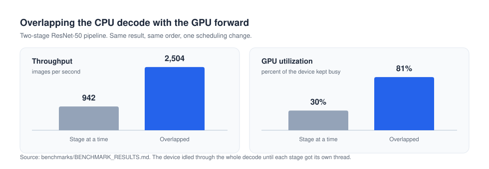

# Batcher

```{raw} html
<div class="bt-hero">
  <p class="bt-hero-eyebrow">Any data &middot; Any AI workload &middot; Batch &amp; streaming</p>
  <p class="bt-hero-tagline">One engine for every kind of data, and every kind of AI.</p>
  <p class="bt-hero-sub">
    Structured tables, unstructured text, images, audio, video. SQL, DataFrames, and
    expressions. Batch jobs and live streams. Batcher runs all of it on a single
    engine &mdash; from a laptop to a cluster &mdash; and tunes itself as the query runs.
  </p>
  <p class="bt-hero-cta">
    <a class="bt-btn bt-btn-primary" href="getting-started/index.html">Get started</a>
    <a class="bt-btn" href="getting-started/quickstart.html">Quickstart</a>
    <a class="bt-btn" href="https://github.com/stephenoffer/batcher">GitHub</a>
  </p>
</div>
```

Data work has splintered into a tool per job. One for SQL, another for DataFrames, a
third for streaming, more again for images and models. Every one of them is a system to
run and a seam to leak. Batcher collapses that stack into a single engine.


## Why Batcher

Every tool stops somewhere, and the gaps between them are where the time goes.

::::{grid} 1 3 3 3
:gutter: 3

:::{grid-item-card} {octicon}`git-branch;1.1em` Outgrow it, rewrite it
A fast single-node engine hits a ceiling. Scaling out means porting the pipeline to a
different system with different semantics.
:::

:::{grid-item-card} {octicon}`stack;1.1em` A tool per job
SQL in one engine, DataFrames in another, separate loaders and servers for ML. Every
hand-off between them is a place for data and effort to leak.
:::

:::{grid-item-card} {octicon}`gear;1.1em` Tuned by hand
Batch sizes, partition counts, join order. Guess wrong and the job stalls or runs out
of memory, often only once it's big enough to matter.
:::
::::

Batcher answers all three at once. The same code runs from a laptop to a cluster, one
engine covers SQL and DataFrames and ML, and the plan re-tunes itself while it runs. You
build the pipeline once, and it keeps working as the data grows.

## Any data, any workload

The same engine reads a Parquet table, a folder of images, or a Kafka stream, and the
same pipeline can clean it, query it, or feed it to a model.

::::{grid} 1 2 2 2
:gutter: 3

:::{grid-item-card} {octicon}`table;1.1em` Structured
Parquet, CSV, JSON, and the lakehouse formats (Delta, Iceberg, Hudi), filtered and
joined and aggregated with SQL or DataFrames.
:::

:::{grid-item-card} {octicon}`file;1.1em` Unstructured
Text, logs, and documents read whole or by the line, then parsed into clean columns
at scale.
:::

:::{grid-item-card} {octicon}`image;1.1em` Multimodal
Images, audio, and video decoded straight into tensors, so one pipeline can clean a
table and feed a model.
:::

:::{grid-item-card} {octicon}`search;1.1em` Vectors & embeddings
First-class list and tensor columns with the vector ops behind embeddings, similarity
search, and RAG.
:::
::::

## Write it your way

Express a transformation as a DataFrame, as SQL, or as composable expressions, then run
it as a batch job or a live stream. Every form builds the same plan and runs on the same
engine, so you can mix them freely.

::::{tab-set}
:::{tab-item} DataFrame
```python
import batcher as bt

sales = bt.from_pydict({"cat": ["a", "b", "a"], "amt": [10.0, 20.0, 30.0]})
revenue = sales.group_by("cat").agg(total=bt.col("amt").sum())
print(revenue.sort("total", descending=True).to_pydict())
# {'cat': ['a', 'b'], 'total': [40.0, 20.0]}
```
:::

:::{tab-item} SQL
```python
import batcher as bt

sales = bt.from_pydict({"cat": ["a", "b", "a"], "amt": [10.0, 20.0, 30.0]})
revenue = bt.sql("SELECT cat, SUM(amt) AS total FROM sales GROUP BY cat", sales=sales)
print(revenue.sort("total", descending=True).to_pydict())
# {'cat': ['a', 'b'], 'total': [40.0, 20.0]}
```
:::

:::{tab-item} Expressions
```python
import batcher as bt

ds = bt.from_pydict({"price": [10.0, 20.0, 30.0], "qty": [1, 2, 3]})
revenue = bt.col("price") * bt.col("qty")            # a value you build once
tier = bt.when(revenue > 40).then(bt.lit("high")).otherwise(bt.lit("low"))
print(ds.select(revenue=revenue, tier=tier).to_pydict())
# {'revenue': [10.0, 40.0, 90.0], 'tier': ['low', 'low', 'high']}
```
:::

:::{tab-item} Streaming
```python
# docs: skip
import batcher as bt

# the same group-by, now over an unbounded source
clicks = bt.read.kafka(topic="clicks")
counts = clicks.group_by("page").agg(n=bt.count())

# batch (default) → micro-batch → continuous: change one argument
counts.write.parquet("out/", trigger=bt.Trigger.processing_time("10s"))
```
:::
::::

Expressions carry typed accessors for every column kind (`.str`, `.dt`, `.list`,
`.struct`), so the column language stays the same whether you reach for it from a
DataFrame, from SQL, or inside a stream.

## Explore the capabilities

::::{grid} 1 2 3 3
:gutter: 3

:::{grid-item-card} {octicon}`rocket;1.1em` Getting started
:link: getting-started/index
:link-type: doc
Install and run your first pipeline.
:::

:::{grid-item-card} {octicon}`download;1.1em` Reading data
:link: user-guide/reading-data
:link-type: doc
Files, object storage, databases, and streams.
:::

:::{grid-item-card} {octicon}`pencil;1.1em` Transformations
:link: user-guide/transformations
:link-type: doc
Select, derive, reshape, and explode columns.
:::

:::{grid-item-card} {octicon}`filter;1.1em` Filtering
:link: user-guide/filtering
:link-type: doc
Predicates, null handling, and sampling.
:::

:::{grid-item-card} {octicon}`graph;1.1em` Aggregations
:link: user-guide/aggregations
:link-type: doc
Group, summarize, pivot, and roll up.
:::

:::{grid-item-card} {octicon}`git-merge;1.1em` Joins
:link: user-guide/joins
:link-type: doc
Inner, outer, semi, anti, and as-of joins.
:::

:::{grid-item-card} {octicon}`versions;1.1em` Window functions
:link: user-guide/window-functions
:link-type: doc
Ranking, running totals, lag and lead.
:::

:::{grid-item-card} {octicon}`code;1.1em` Expressions
:link: user-guide/expressions
:link-type: doc
The composable column language and its accessors.
:::

:::{grid-item-card} {octicon}`database;1.1em` SQL
:link: user-guide/sql
:link-type: doc
Full SQL that lowers to the same engine.
:::

:::{grid-item-card} {octicon}`broadcast;1.1em` Streaming
:link: user-guide/streaming
:link-type: doc
Watermarks, windows, and exactly-once output.
:::

:::{grid-item-card} {octicon}`beaker;1.1em` Machine learning
:link: ml/index
:link-type: doc
Batch inference, embeddings, and training data.
:::

:::{grid-item-card} {octicon}`cloud;1.1em` Cloud & lakehouse
:link: user-guide/cloud-storage
:link-type: doc
S3, GCS, Azure, and Delta / Iceberg / Hudi.
:::

:::{grid-item-card} {octicon}`arrow-switch;1.1em` Coming from pandas / Polars / Spark / SQL
:link: migration/index
:link-type: doc
Translate the API you already know, side by side.
:::

:::{grid-item-card} {octicon}`meter;1.1em` Benchmarks
:link: benchmarks/index
:link-type: doc
Correctness-gated numbers across every workload, with the methodology behind each one.
:::

:::{grid-item-card} {octicon}`book;1.1em` Recipes
:link: examples/index
:link-type: doc
Four cookbooks: data engineering, analytics, ML, and streaming.
:::

:::{grid-item-card} {octicon}`plug;1.1em` Integrations
:link: integrations/index
:link-type: doc
Kafka, Snowflake, BigQuery, Delta, Iceberg, Ray, PyTorch, and the rest of your stack.
:::

:::{grid-item-card} {octicon}`telescope;1.1em` Deep dives
:link: deep-dives/index
:link-type: doc
How the engine actually works, one mechanism at a time.
:::
::::

## It tunes itself

You don't size batches, pick join strategies, or guess partition counts. Batcher
re-optimizes at stage boundaries on measured cardinalities, the same mechanism and the same
granularity as Spark AQE, but available single-node too. It stays off for queries under 20M
input rows, so most queries never reach it.

The half that has no equivalent in DuckDB or Spark is what happens *between* runs. A
sketch-backed learned-stats and bandit loop records what each query actually did, so the
plan improves the more often you run it. The {doc}`architecture/index` covers both halves,
and {doc}`deep-dives/adaptive-reoptimization` covers where each one stops.

## How it compares

Each tool stops somewhere. Batcher aims at the whole range on one engine.

```{raw} html
<table class="bt-matrix">
<thead><tr><th>Capability</th>
<th>Batcher</th>
<th>DuckDB</th>
<th>Polars</th>
<th>Spark</th>
</tr></thead><tbody>
<tr><td>Runs in-process, no cluster</td><td><span class="y">✓</span></td><td><span class="y">✓</span></td><td><span class="y">✓</span></td><td><span class="n">—</span></td></tr>
<tr><td>Sub-second small queries</td><td><span class="y">✓</span></td><td><span class="y">✓</span></td><td><span class="y">✓</span></td><td><span class="n">—</span></td></tr>
<tr><td>Scales to a cluster</td><td><span class="y">✓</span></td><td><span class="n">—</span></td><td><span class="n">—</span></td><td><span class="y">✓</span></td></tr>
<tr><td>Same code, laptop to cluster</td><td><span class="y">✓</span></td><td><span class="n">—</span></td><td><span class="n">—</span></td><td><span class="p">~</span></td></tr>
<tr><td>SQL</td><td><span class="y">✓</span></td><td><span class="y">✓</span></td><td><span class="p">~</span></td><td><span class="y">✓</span></td></tr>
<tr><td>DataFrame API</td><td><span class="y">✓</span></td><td><span class="p">~</span></td><td><span class="y">✓</span></td><td><span class="y">✓</span></td></tr>
<tr><td>Composable expression API</td><td><span class="y">✓</span></td><td><span class="p">~</span></td><td><span class="y">✓</span></td><td><span class="y">✓</span></td></tr>
<tr><td>Cost-based optimizer</td><td><span class="y">✓</span></td><td><span class="y">✓</span></td><td><span class="p">~</span></td><td><span class="y">✓</span></td></tr>
<tr><td>Stage-boundary re-optimization, single-node</td><td><span class="y">✓</span></td><td><span class="n">—</span></td><td><span class="n">—</span></td><td><span class="n">—</span></td></tr>
<tr><td>Cross-query learned statistics</td><td><span class="y">✓</span></td><td><span class="n">—</span></td><td><span class="n">—</span></td><td><span class="n">—</span></td></tr>
<tr><td>Streaming</td><td><span class="y">✓</span></td><td><span class="n">—</span></td><td><span class="p">~</span></td><td><span class="y">✓</span></td></tr>
<tr><td>ML / batch inference</td><td><span class="y">✓</span></td><td><span class="n">—</span></td><td><span class="n">—</span></td><td><span class="p">~</span></td></tr>
<tr><td>Multimodal (images, audio, video)</td><td><span class="y">✓</span></td><td><span class="n">—</span></td><td><span class="n">—</span></td><td><span class="p">~</span></td></tr>
<tr><td>Out-of-core spill</td><td><span class="y">✓</span></td><td><span class="y">✓</span></td><td><span class="p">~</span></td><td><span class="y">✓</span></td></tr>
</tbody></table>
<p class="bt-matrix-legend"><span class="y">✓</span> built-in &nbsp; <span class="p">~</span> partial or via an add-on &nbsp; <span class="n">—</span> not supported. A capability view, not a benchmark.</p>
```

Speed is measured correctness-first: the benchmark harness refuses to time a query
whose result doesn't match DuckDB, and every operator is differential-tested against
it.

## Benchmarks

Numbers, not adjectives, and every one is **correctness-gated**: the harness runs each query
on every engine, checks they return the identical result, and only then trusts the timing. A
fast wrong answer is a bug, not a win. The gate earns its keep. On TPC-H q6 both Daft and
Polars compute the wrong revenue, and the harness refuses to time them.

These are the headline results. The full picture, including the methodology behind every
figure, is in {doc}`benchmarks/index`.

### AI and multimodal

Ten GPU workload families on 8xT4, real models, every run gated on prediction agreement. On
every family where device utilization was sampled, the GPU holds at or above the 80% target:

![Horizontal bar chart of sustained GPU utilization by workload family on 8xT4 with real models and 100 percent output agreement. Compute-bound ResNet-50 FP16 inference holds 100 percent at 4,707 images per second, a decode-heavy JPEG to ResNet pipeline 93.4 percent at 3,860, fractional GPU packing of EfficientNet-B0 89 percent at 6,764, zero-config inference with no batch size given 82 percent at 2,451, ResNet-50 batch inference 81 percent at 2,504, and image embeddings 80 percent at 2,502. A dashed line marks the 80 percent target.](_static/diagrams/gpu_utilization.svg)

Throughput on the model workloads runs from **33,611 text/s** embedding with MiniLM and
**38,546 clip/s** on audio feature extraction down to **169 img/s** on a diffusion model, and
`iter_torch_batches` feeds a training loop at **1.06 M rows/s** zero-copy. Decoding JPEGs into
tensors runs at 5,693 img/s, 2.4x Daft. `map_batches(Model, num_gpus=1)` with no batch size
given picks a VRAM-safe default and lands within 2% of the hand-tuned path.

Stage-overlapped streaming is why the device stays fed. The CPU decode of the next morsel runs
while the GPU forward of the current one is still in flight.



### Analytics: three suites, measured 2026-07-18

Single node, 16 cores, release build. Every engine reads the **identical zero-copy Arrow
input**, so this compares execution rather than storage formats.

| suite | vs DuckDB on the same Arrow |
|---|---|
| **TPC-H**, 22 comparable queries | **won 22 of 22**, 1.1x to 7.1x faster |
| **ClickBench**, 43 queries | **won 42 of 43**, and 43/43 correct |
| **Semi-structured JSON**, 5 queries | **won 5 of 5**, 3.6x to 12.5x faster |
| **Operator mix**, 11 kernels | **won 10 of 11** |

Against Polars the JSON suite is **11x to 100x faster**, and Polars' SQL front-end cannot
express most of TPC-H at all (multi-table `FROM`, `EXISTS`, non-equi joins).

Run TPC-H against DuckDB's own compressed store instead, where it decompresses as it scans and
never pays an Arrow ingest, and DuckDB leads on the join-heavy queries. Both columns are
published per query in {doc}`benchmarks/tpch`.

Seven ClickBench queries return in about 0.2 ms because Kyber answers them from **metadata**,
meaning footer statistics and sketches, rather than scanning at all. Those are excluded from
the ranges above, so the headline reflects execution rather than planning.

The same lazy control plane answers `count()` in **0.05 ms** after a chain of transformations,
and reading 20M rows across 64 Parquet files and summing a column takes **72 ms**.

### Cluster against cluster

The mergeable algebra means the *same* operators run distributed. TPC-H sf10 q6 on an 8-node,
128-CPU cluster, with **both engines distributed** and reading the same S3 parquet:

| engine | time | correct? |
|---|---:|---|
| **Batcher** | **224 ms** | ✅ |
| Daft | 536 ms | ❌ wrong answer |
| DuckDB (single-node, its best) | 457 ms | ✅ |

**2.4x faster than Daft on equal hardware, and correct where Daft is not.**

**[Full benchmarks and methodology](benchmarks/index.md)**

### Why the wins happen

None of this is tuning. Each result traces to a design choice you can read about in the
[architecture guide](architecture/index.md).

Batcher runs in-process and native over Arrow, with no task-scheduler or object-store hop per
operation, so a small query pays almost no fixed cost before it starts doing real work. On the
same input, that is what lets an execution engine win a suite outright rather than query by
query.

On the AI side, GPU inference loads a model once per session and overlaps CPU prep with the
GPU forward pass, which is what holds the device at or above 80% utilization wherever it was
sampled. And plans re-tune on measured cardinalities mid-query, so a bad estimate corrects
itself rather than stalling or running out of memory.

## Where to start

The docs branch by what you are doing, not by what part of the engine you are touching.

- **New here?** {doc}`getting-started/index` installs Batcher and runs a first query, then
  {doc}`getting-started/concepts/index` covers the one idea the rest of the API rests on.
- **Porting something?** {doc}`migration/index` maps Spark, pandas, Polars, and SQL verb by
  verb, and proves the port returns the same rows.
- **Building something specific?** {doc}`user-guide/index` is one page per capability, and
  {doc}`examples/index` is working code you can paste and change.
- **Running a model?** {doc}`ml/index` covers inference, embeddings, retrieval, and feeding
  a training loop.
- **Curious how it works?** {doc}`architecture/index` gives the shape, and
  {doc}`deep-dives/index` takes one mechanism at a time.

If you would rather be handed an ordered reading list for your role, use
{doc}`learning-paths/index`.

```{toctree}
:hidden:
:caption: Learn

getting-started/index
tutorials/index
examples/index
learning-paths/index
```

```{toctree}
:hidden:
:caption: Guides

user-guide/index
ml/index
integrations/index
configuration/index
migration/index
agents/index
```

```{toctree}
:hidden:
:caption: Reference

api/index
benchmarks/index
```

```{toctree}
:hidden:
:caption: How it works

architecture/index
deep-dives/index
internals/index
```
