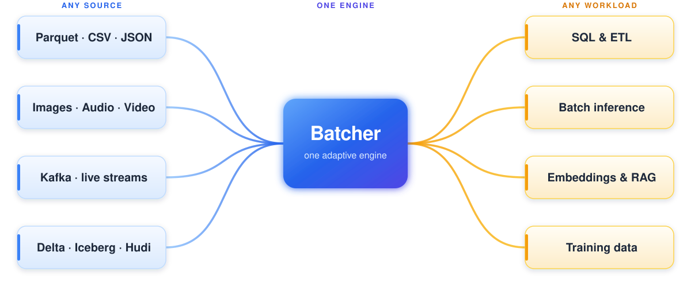

# Batcher

```{raw} html
<div class="bt-hero">
  <p class="bt-hero-eyebrow">Any data &middot; Any workload &middot; Batch &amp; streaming</p>
  <p class="bt-hero-tagline">One engine for every kind of data, from SQL to models.</p>
  <p class="bt-hero-sub">
    Tables, text, images, audio, video. SQL, DataFrames, and expressions. Batch jobs and
    live streams, analytics and inference. Batcher runs all of it on one engine, from a
    laptop to a cluster, and tunes itself as the query runs.
  </p>
  <p class="bt-hero-cta">
    <a class="bt-btn bt-btn-primary" href="getting-started/index.html">Get started</a>
    <a class="bt-btn" href="getting-started/quickstart.html">Quickstart</a>
    <a class="bt-btn" href="benchmarks/index.html">See the numbers</a>
    <a class="bt-btn" href="https://github.com/stephenoffer/batcher">GitHub</a>
  </p>
</div>

<div class="bt-stats">
  <div class="bt-stat">
    <span class="bt-stat-value">2.37&times;</span>
    <span class="bt-stat-label">faster than DuckDB on the same Arrow</span>
    <span class="bt-stat-src">TPC-H sf1, 16 cores, 22 of 22 queries won</span>
  </div>
  <div class="bt-stat">
    <span class="bt-stat-value">43 / 43</span>
    <span class="bt-stat-label">ClickBench queries won</span>
    <span class="bt-stat-src">vs DuckDB on the same Arrow, 43 of 43 correct</span>
  </div>
  <div class="bt-stat">
    <span class="bt-stat-value">81%</span>
    <span class="bt-stat-label">sustained GPU utilization</span>
    <span class="bt-stat-src">ResNet-50 batch inference, 8&times;T4, 2,504 img/s</span>
  </div>
  <div class="bt-stat">
    <span class="bt-stat-value">0.05 ms</span>
    <span class="bt-stat-label">to answer <code>count()</code> after a transform chain</span>
    <span class="bt-stat-src">read from footer statistics, no scan</span>
  </div>
</div>
```

Every figure on this site is correctness-gated: the harness runs the query on each engine,
compares the results, and refuses to record a timing when they disagree. A missing number
means a wrong answer, not a slow one.

## What Batcher is

Data work has splintered into a tool per job. One for SQL, another for DataFrames, a third
for streaming, more again for images and models. Every one of them is a system to run and a
seam to leak. Batcher collapses that stack into a single engine: a Python control plane over
a Rust data plane on Apache Arrow.



One decision buys most of that. Every stateful operator exists once, as a mergeable
`partial → combine → finalize` triple in Rust over Arrow. One core, ninety-six cores, and a
cluster differ only in how that triple is scheduled, so scaling out is a scheduling decision
rather than a port. The same triple is the incremental form, so batch is the bounded case of
streaming rather than a second execution model. Because the operator is identical everywhere,
a measurement taken anywhere is valid everywhere, which is what lets the optimizer plan from
evidence instead of vendor constants. And decode, embedding, vector search, and inference are
expressions in that same algebra, so a predicate pushes beneath a JPEG decode and a tensor
never leaves the engine.

## The numbers

Every engine reads the identical zero-copy Arrow input, so these compare execution rather
than storage formats.

| Suite | Result |
|---|---|
| TPC-H sf1, 22 queries, 16 cores | **2.37x** DuckDB on the same Arrow, won 22 of 22; 1.26x Polars |
| TPC-H sf10, 22 queries, 96 cores | **1.89x** DuckDB on the same Arrow, won 21 of 22; 2.26x Polars |
| ClickBench, 43 queries | **won 43 of 43** vs DuckDB on the same Arrow, and 43 of 43 correct |
| Semi-structured JSON, 5 queries | won 5 of 5, **3.6x to 12.5x** DuckDB, 11x to 100x Polars |
| Image decode to tensor | **5,693 img/s**, 2.4x Daft |
| ResNet-50 batch inference, 8xT4 | **2,504 img/s** at 81% GPU utilization |
| Text embeddings, MiniLM, 8xT4 | **33,611 text/s** |
| TPC-H sf10 q6, cluster against cluster | **2.4x** Daft on equal hardware, and Daft's answer is wrong |


Those rows were not all measured on the same machine, because the workload families were
not. A figure is meaningful within its row. {doc}`benchmarks/index` carries the full grid,
the hardware per family, the reproduction commands, and the two comparisons that run the
other way: DuckDB's own compressed store on join-heavy SQL, and Daft on multi-join shapes.

## Write it your way

Express a transformation as a DataFrame, as SQL, or as composable expressions, then run it as
a batch job or a live stream. Every form builds the same plan and runs on the same engine, so
you can mix them freely.

::::{tab-set}
:::{tab-item} DataFrame
```python
import batcher as bt

sales = bt.from_pydict({"cat": ["a", "b", "a"], "amt": [10.0, 20.0, 30.0]})
revenue = sales.group_by("cat").agg(total=bt.col("amt").sum())
print(revenue.sort("total", descending=True).to_pydict())
# {'cat': ['a', 'b'], 'total': [40.0, 20.0]}
```
:::

:::{tab-item} SQL
```python
import batcher as bt

sales = bt.from_pydict({"cat": ["a", "b", "a"], "amt": [10.0, 20.0, 30.0]})
revenue = bt.sql("SELECT cat, SUM(amt) AS total FROM sales GROUP BY cat", sales=sales)
print(revenue.sort("total", descending=True).to_pydict())
# {'cat': ['a', 'b'], 'total': [40.0, 20.0]}
```
:::

:::{tab-item} Expressions
```python
import batcher as bt

ds = bt.from_pydict({"price": [10.0, 20.0, 30.0], "qty": [1, 2, 3]})
revenue = bt.col("price") * bt.col("qty")            # a value you build once
tier = bt.when(revenue > 40).then(bt.lit("high")).otherwise(bt.lit("low"))
print(ds.select(revenue=revenue, tier=tier).to_pydict())
# {'revenue': [10.0, 40.0, 90.0], 'tier': ['low', 'low', 'high']}
```
:::

:::{tab-item} Streaming
```python
# docs: skip
import batcher as bt

# the same group-by, now over an unbounded source
clicks = bt.read.kafka(topic="clicks")
counts = clicks.group_by("page").agg(n=bt.count())

# batch (default) → micro-batch → continuous: change one argument
counts.write.parquet("out/", trigger=bt.Trigger.processing_time("10s"))
```
:::
::::

Expressions carry typed accessors for every column kind (`.str`, `.dt`, `.list`, `.struct`),
so the column language stays the same whether you reach for it from a DataFrame, from SQL, or
inside a stream.

## What it does

Each card is one capability family, linked to the guide that covers it.

::::{grid} 1 2 2 2
:gutter: 3

:::{grid-item-card} {octicon}`table;1.1em` Read anything
:link: /user-guide/moving-data/reading-data
:link-type: doc
Parquet, CSV, JSON, Arrow, ORC, Avro. Text, logs, and documents. Images, audio, and video.
Databases and warehouses over JDBC. Kafka, Kinesis, Pulsar, and Pub/Sub.
:::

:::{grid-item-card} {octicon}`pencil;1.1em` Query and transform
:link: /user-guide/index
:link-type: doc
Filter, project, join, aggregate, window, pivot, sort, sample, and explode, in SQL or
DataFrame form. Typed accessors for strings, dates, lists, structs, and JSON.
:::

:::{grid-item-card} {octicon}`stack;1.1em` Lakehouse tables
:link: /user-guide/moving-data/lakehouse
:link-type: doc
Delta, Iceberg, and Hudi with transactional writes, `MERGE INTO` upserts, change feeds,
time travel, schema evolution, and compaction.
:::

:::{grid-item-card} {octicon}`broadcast;1.1em` Streaming
:link: /user-guide/moving-data/streaming
:link-type: doc
Unbounded sources, triggers, watermarks and late data, windowed and stateful aggregation,
stream joins, checkpointing, and exactly-once delivery into a transactional sink.
:::

:::{grid-item-card} {octicon}`beaker;1.1em` Models and inference
:link: /ml/index
:link-type: doc
Batch inference on GPU, LLM scoring, embeddings and vector search, RAG, tabular models,
preprocessors, and zero-copy loaders for PyTorch training.
:::

:::{grid-item-card} {octicon}`image;1.1em` Multimodal and vectors
:link: /ml/preparing/multimodal/index
:link-type: doc
Images, audio, and video decoded straight into tensor columns, with first-class list and
tensor types and the vector ops behind similarity search.
:::

:::{grid-item-card} {octicon}`shield-check;1.1em` Quality and governance
:link: /user-guide/trust/data-quality
:link-type: doc
Data-quality contracts that fail, drop, or quarantine bad rows. Column masking and
row-level security applied as a plan rewrite, plus column-level lineage.
:::

:::{grid-item-card} {octicon}`graph;1.1em` Scale and operate
:link: /user-guide/operate/tuning/performance
:link-type: doc
Out-of-core spill, caching, a Ray-backed distributed path, explain plans, a live progress
UI, and metrics. The same code from a laptop to a cluster.
:::
::::

## It tunes itself

You don't size batches, pick join strategies, or guess partition counts. Batcher re-optimizes
at stage boundaries on measured cardinalities, the same mechanism and the same granularity as
Spark AQE, but available single-node too. It engages only on a joined query whose scan input
clears 20M rows or roughly 1.3 GB, so most small queries never reach it.

The half with no equivalent in DuckDB or Spark is what happens *between* runs. A sketch-backed
learned-stats and bandit loop records what each query actually did, so the plan improves the
more often you run it. {doc}`architecture/differentiators` covers both halves, and where each
one stops.

## How it compares

Each tool stops somewhere. Batcher aims at the whole range on one engine. This is a capability
view rather than a benchmark; for timings, read {doc}`benchmarks/index`.

```{raw} html
<table class="bt-matrix">
<thead><tr><th>Capability</th>
<th>Batcher</th>
<th>DuckDB</th>
<th>Polars</th>
<th>Spark</th>
</tr></thead><tbody>
<tr><td>Runs in-process, no cluster</td><td><span class="y">✓</span></td><td><span class="y">✓</span></td><td><span class="y">✓</span></td><td><span class="n">—</span></td></tr>
<tr><td>Sub-second small queries</td><td><span class="y">✓</span></td><td><span class="y">✓</span></td><td><span class="y">✓</span></td><td><span class="n">—</span></td></tr>
<tr><td>Scales to a cluster</td><td><span class="y">✓</span></td><td><span class="n">—</span></td><td><span class="n">—</span></td><td><span class="y">✓</span></td></tr>
<tr><td>Same code, laptop to cluster</td><td><span class="y">✓</span></td><td><span class="n">—</span></td><td><span class="n">—</span></td><td><span class="p">~</span></td></tr>
<tr><td>SQL</td><td><span class="y">✓</span></td><td><span class="y">✓</span></td><td><span class="p">~</span></td><td><span class="y">✓</span></td></tr>
<tr><td>DataFrame API</td><td><span class="y">✓</span></td><td><span class="p">~</span></td><td><span class="y">✓</span></td><td><span class="y">✓</span></td></tr>
<tr><td>Composable expression API</td><td><span class="y">✓</span></td><td><span class="p">~</span></td><td><span class="y">✓</span></td><td><span class="y">✓</span></td></tr>
<tr><td>Cost-based optimizer</td><td><span class="y">✓</span></td><td><span class="y">✓</span></td><td><span class="p">~</span></td><td><span class="y">✓</span></td></tr>
<tr><td>Stage-boundary re-optimization, single-node</td><td><span class="y">✓</span></td><td><span class="n">—</span></td><td><span class="n">—</span></td><td><span class="n">—</span></td></tr>
<tr><td>Cross-query learned statistics</td><td><span class="y">✓</span></td><td><span class="n">—</span></td><td><span class="n">—</span></td><td><span class="n">—</span></td></tr>
<tr><td>Streaming</td><td><span class="y">✓</span></td><td><span class="n">—</span></td><td><span class="p">~</span></td><td><span class="y">✓</span></td></tr>
<tr><td>ML / batch inference</td><td><span class="y">✓</span></td><td><span class="n">—</span></td><td><span class="n">—</span></td><td><span class="p">~</span></td></tr>
<tr><td>Multimodal (images, audio, video)</td><td><span class="y">✓</span></td><td><span class="n">—</span></td><td><span class="n">—</span></td><td><span class="p">~</span></td></tr>
<tr><td>Out-of-core spill</td><td><span class="y">✓</span></td><td><span class="y">✓</span></td><td><span class="p">~</span></td><td><span class="y">✓</span></td></tr>
</tbody></table>
<p class="bt-matrix-legend"><span class="y">✓</span> built-in &nbsp; <span class="p">~</span> partial or via an add-on &nbsp; <span class="n">—</span> not supported.</p>
```

## Find your way around

The site has ten sections, and they branch by what you are doing rather than by which part of
the engine you are touching.

::::{grid} 1 2 2 2
:gutter: 3

:::{grid-item-card} {octicon}`rocket;1.1em` Getting started
:link: /getting-started/index
:link-type: doc
Install Batcher, run a first query, learn the core concepts, and translate what you already
know from Spark, pandas, Polars, DuckDB, or Daft.
:::

:::{grid-item-card} {octicon}`book;1.1em` Tutorials
:link: /tutorials/index
:link-type: doc
Ten end-to-end walkthroughs, plus a reading path ordered for a data engineer, data
scientist, ML engineer, or platform engineer.
:::

:::{grid-item-card} {octicon}`repo;1.1em` User guide
:link: /user-guide/index
:link-type: doc
One page per capability: moving data, transforming it, analyzing it, trusting it, and
operating it at scale.
:::

:::{grid-item-card} {octicon}`beaker;1.1em` ML and inference
:link: /ml/index
:link-type: doc
Preparing data for models, batch inference, retrieval and generation, evaluation, and
feeding a training loop.
:::

:::{grid-item-card} {octicon}`plug;1.1em` Integrations
:link: /integrations/index
:link-type: doc
Kafka, Snowflake, BigQuery, Delta, Iceberg, Hudi, MongoDB, Elasticsearch, Ray, PyTorch, and
Hugging Face.
:::

:::{grid-item-card} {octicon}`code;1.1em` Cookbook
:link: /cookbook/index
:link-type: doc
About 150 runnable pages, from a one-method recipe to a complete pipeline, every one of
them executed by the test suite.
:::

:::{grid-item-card} {octicon}`code-square;1.1em` API reference
:link: /api/index
:link-type: doc
Every public name, a one-page quick reference, and the full signature listing.
:::

:::{grid-item-card} {octicon}`sliders;1.1em` Configuration
:link: /configuration/index
:link-type: doc
Profiles, options, environment variables, accelerators, and fault-tolerance settings.
:::

:::{grid-item-card} {octicon}`graph;1.1em` Benchmarks
:link: /benchmarks/index
:link-type: doc
The full grid against DuckDB, Polars, Spark, and Daft, the methodology, and the shapes
where Batcher loses.
:::

:::{grid-item-card} {octicon}`telescope;1.1em` Architecture
:link: /architecture/index
:link-type: doc
How the engine works at three zoom levels: the shape of the system, one mechanism at a
time, then each subsystem's design.
:::
::::

Writing Batcher with an AI agent? {doc}`The skill catalog <agents>` holds task-scoped recipes
for authoring a pipeline, then debugging and scaling it.

```{toctree}
:hidden:
:caption: Start here

getting-started/index
tutorials/index
```

```{toctree}
:hidden:
:caption: Guides

user-guide/index
ml/index
integrations/index
agents
```

```{toctree}
:hidden:
:caption: Recipes

cookbook/index
```

```{toctree}
:hidden:
:caption: Reference

api/index
configuration/index
benchmarks/index
```

```{toctree}
:hidden:
:caption: How it works

architecture/index
```
