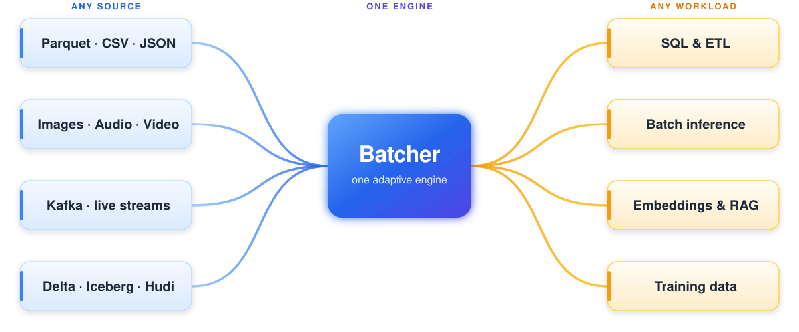
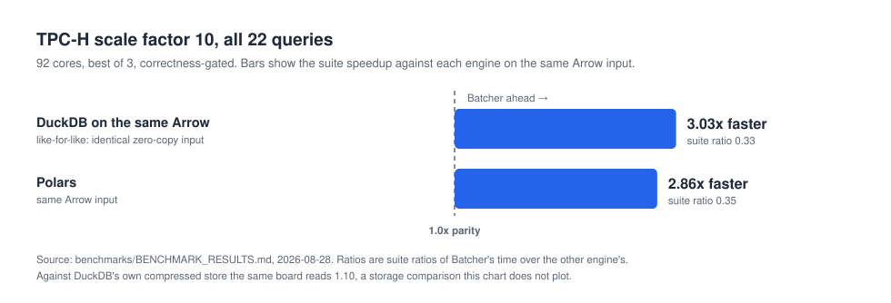

# Batcher

```{raw} html
<div class="bt-hero">
  
  <p class="bt-hero-eyebrow">Any data &middot; Any workload &middot; Batch &amp; streaming</p>
  <p class="bt-hero-tagline">One engine for every kind of data, from SQL to models.</p>
  <p class="bt-hero-sub">
    Tables, text, images, audio, video. SQL, DataFrames, and expressions. Batch jobs and
    live streams, analytics and inference. Batcher runs all of it on one engine, from a
    laptop to a cluster, and tunes itself as the query runs.
  </p>
  <p class="bt-hero-cta">
    <a class="bt-btn bt-btn-primary" href="getting-started/index.html">Get started</a>
    <a class="bt-btn" href="getting-started/quickstart.html">Quickstart</a>
    <a class="bt-btn" href="benchmarks/index.html">See the numbers</a>
    <a class="bt-btn" href="https://github.com/stephenoffer/batcher">GitHub</a>
  </p>
</div>

<div class="bt-stats">
  <div class="bt-stat">
    <span class="bt-stat-value">4.0&times;</span>
    <span class="bt-stat-label">faster than DuckDB on the same Arrow</span>
    <span class="bt-stat-src">TPC-H sf1, 22 queries, 48 cores</span>
  </div>
  <div class="bt-stat">
    <span class="bt-stat-value">6.3&times;</span>
    <span class="bt-stat-label">faster than DuckDB on the same Arrow</span>
    <span class="bt-stat-src">ClickBench, 43 queries, 48 cores</span>
  </div>
  <div class="bt-stat">
    <span class="bt-stat-value">6 / 6</span>
    <span class="bt-stat-label">benchmark suites faster than Polars</span>
    <span class="bt-stat-src">TPC-H, ClickBench, H2O, JSON, operators</span>
  </div>
  <div class="bt-stat">
    <span class="bt-stat-value">2.4&times;</span>
    <span class="bt-stat-label">faster than Ray Data on GPU inference</span>
    <span class="bt-stat-src">100,000 images, six T4 nodes, same checksum</span>
  </div>
  <div class="bt-stat">
    <span class="bt-stat-value">81%</span>
    <span class="bt-stat-label">sustained GPU utilization</span>
    <span class="bt-stat-src">ResNet-50 batch inference, 8&times;T4, 2,504 img/s</span>
  </div>
</div>
```

Every ratio on this site is correctness-gated. No timing counts until the engines agree on the result, as {doc}`benchmarks/index` explains.

## What Batcher is

Most data teams run one tool for SQL, another for DataFrames, a third for streams, and more again for images and models. Batcher is one engine for all of it: a Python control plane over a Rust data plane on Apache Arrow. SQL and DataFrames compile to the same plan, and so do streaming, media decode and model inference. The same operators run it on one core, on every core, or across a Ray cluster.



```python
import batcher as bt

ds = bt.from_pydict({"city": ["Oslo", "Lima", "Oslo"], "temp": [3.5, 19.0, 5.5]})
print(ds.group_by("city").agg(avg=bt.col("temp").mean()).sort("city").to_pydict())
# {'city': ['Lima', 'Oslo'], 'avg': [19.0, 4.5]}
```

## Start from your job

Each path is an ordered reading list through the tutorials and guides. Pick yours.

::::{grid} 1 2 2 4
:gutter: 3

:::{grid-item-card} {octicon}`database;1.1em` Data engineer
:link: /getting-started/tutorials/paths/data-engineer
:link-type: doc
Pipelines that read, reshape, join and write, plus lakehouse tables and data-quality checks.
:::

:::{grid-item-card} {octicon}`graph;1.1em` Data scientist
:link: /getting-started/tutorials/paths/data-scientist
:link-type: doc
Expressions, aggregations, SQL, and window functions over a dataset.
:::

:::{grid-item-card} {octicon}`cpu;1.1em` ML engineer
:link: /getting-started/tutorials/paths/ml-engineer
:link-type: doc
Batch inference, embeddings, and GPUs through `.ml`.
:::

:::{grid-item-card} {octicon}`server;1.1em` Platform engineer
:link: /getting-started/tutorials/paths/platform-engineer
:link-type: doc
Configuration and environment defaults, memory limits, object storage.
:::
::::

Coming from another engine? {doc}`The migration guides </getting-started/migration/index>` translate Spark, pandas, Polars, DuckDB, Ray Data, and Daft code into Batcher.

## Write it your way

DataFrames, SQL, expressions and streams all build the same plan. Mix them freely.

::::{tab-set}
:::{tab-item} DataFrame
```python
import batcher as bt

sales = bt.from_pydict({"cat": ["a", "b", "a"], "amt": [10.0, 20.0, 30.0]})
revenue = sales.group_by("cat").agg(total=bt.col("amt").sum())
print(revenue.sort("total", descending=True).to_pydict())
# {'cat': ['a', 'b'], 'total': [40.0, 20.0]}
```
:::

:::{tab-item} SQL
```python
import batcher as bt

sales = bt.from_pydict({"cat": ["a", "b", "a"], "amt": [10.0, 20.0, 30.0]})
revenue = bt.sql("SELECT cat, SUM(amt) AS total FROM sales GROUP BY cat", sales=sales)
print(revenue.sort("total", descending=True).to_pydict())
# {'cat': ['a', 'b'], 'total': [40.0, 20.0]}
```
:::

:::{tab-item} Expressions
```python
import batcher as bt

ds = bt.from_pydict({"price": [10.0, 20.0, 30.0], "qty": [1, 2, 3]})
revenue = bt.col("price") * bt.col("qty")  # a value you build once
tier = bt.when(revenue > 40).then(bt.lit("high")).otherwise(bt.lit("low"))
print(ds.select(revenue=revenue, tier=tier).to_pydict())
# {'revenue': [10.0, 40.0, 90.0], 'tier': ['low', 'low', 'high']}
```
:::

:::{tab-item} Streaming
```python
# docs: skip
import batcher as bt
from batcher import col

# every Parquet file that lands in the directory, read as an unbounded stream
clicks = bt.read.files_incremental("landing/clicks", "parquet", state_dir="state/seen")

# page views per one-minute event-time window; the watermark bounds the open state
counts = (
    clicks.with_watermark("ts", "10 minutes")
    .group_by("page", w=bt.window(col("ts"), "1 minute"))
    .agg(n=bt.count())
)

# every 10 seconds, append the windows the watermark closed since the last trigger
counts.write.parquet(
    "out/", trigger=bt.Trigger.processing_time("10s"), checkpoint="state/checkpoint"
)
```

Each `(page, window)` count is written once, after the watermark closes the window, and the checkpoint lets a restarted query resume where it stopped. See {doc}`user-guide/moving-data/streaming/emission` and {doc}`/integrations/streams/kafka`.
:::

:::{tab-item} Vectors
```python
import batcher as bt

docs = bt.from_pydict({"doc": ["a", "b", "c"], "vec": [[1.0, 0.0], [0.0, 1.0], [0.9, 0.1]]})
near = docs.ml.similarity_to([1.0, 0.0], column="vec").sort("score", descending=True)
print(near.limit(2).select("doc").to_pydict())
# {'doc': ['a', 'c']}
```
:::
::::

Expressions carry typed accessors for every column kind ({py:class}`.str <batcher.plan.expr_ir.namespaces.strings._StrNamespace>`, {py:class}`.dt <batcher.plan.expr_ir.namespaces.temporal._DtNamespace>`, {py:class}`.list <batcher.plan.expr_ir.namespaces.collections._ListNamespace>`, {py:class}`.struct <batcher.plan.expr_ir.namespaces.collections._StructNamespace>`):

```python
people = bt.from_pydict({"name": ["ann", "bob"], "tags": [["a", "b"], ["c"]]})
print(people.select(up=bt.col("name").str.upper(), n=bt.col("tags").list.len()).to_pydict())
# {'up': ['ANN', 'BOB'], 'n': [2, 1]}
```

## What it does

Each card links to its guide. {doc}`getting-started/tour` runs one example of each on a single page.

::::{grid} 1 2 2 2
:gutter: 3

:::{grid-item-card} {octicon}`table;1.1em` Read anything
:link: /user-guide/moving-data/reading-data
:link-type: doc
Parquet, CSV, JSON, Arrow, ORC, Avro. Text, logs and documents. Images, audio and video too.
Databases and warehouses through ADBC, ConnectorX, or any DB-API driver. Kafka, Kinesis, Pulsar, and Pub/Sub.
:::

:::{grid-item-card} {octicon}`pencil;1.1em` Query and transform
:link: /user-guide/index
:link-type: doc
Filter, project, join, aggregate, window, pivot, sort, sample, and explode, in SQL or
DataFrame form. Typed accessors for strings, dates, lists, structs, and JSON.
:::

:::{grid-item-card} {octicon}`stack;1.1em` Lakehouse tables
:link: /user-guide/moving-data/lakehouse
:link-type: doc
Transactional writes, `MERGE INTO` upserts, time travel and schema evolution on Delta and
Iceberg, with change feeds and compaction on Delta. Hudi tables are read-only.
:::

:::{grid-item-card} {octicon}`broadcast;1.1em` Streaming
:link: /user-guide/moving-data/streaming/index
:link-type: doc
Unbounded sources and triggers. Watermarks for late data, windowed and stateful aggregation,
stream joins, and checkpointing with exactly-once delivery into a transactional sink.
:::

:::{grid-item-card} {octicon}`beaker;1.1em` Models and inference
:link: /ml/index
:link-type: doc
Batch inference on GPU, LLM scoring, embeddings and vector search, RAG, tabular models,
preprocessors, and PyTorch loaders that copy each batch into tensors, with a DLPack zero-copy
path for read-only inference.
:::

:::{grid-item-card} {octicon}`image;1.1em` Multimodal and vectors
:link: /ml/preparing/multimodal/index
:link-type: doc
Media decoded straight into tensor columns, with first-class list and
tensor types and the vector ops behind similarity search.
:::

:::{grid-item-card} {octicon}`shield-check;1.1em` Quality and governance
:link: /user-guide/trust/data-quality
:link-type: doc
Data-quality contracts that fail, drop, or quarantine bad rows. Column masking and
row-level security applied as a plan rewrite, plus column-level lineage.
:::

:::{grid-item-card} {octicon}`graph;1.1em` Scale and operate
:link: /user-guide/operate/tuning/performance
:link-type: doc
Out-of-core spill, caching, a Ray-backed distributed path, explain plans, a live progress
UI, and metrics. The same code from a laptop to a cluster.
:::
::::

## It tunes itself

You don't size batches or guess partition counts. On a large joined query, Batcher re-plans at stage boundaries from the cardinalities it measured. Between runs, a sketch-backed learned-stats loop records what each query did. Run a query often and it plans from evidence.


{doc}`architecture/differentiators` shows how.

## The numbers

These are speedups, so bigger is better. They come from one 48-core sweep on 2026-09-13, best of five. *Same Arrow* means DuckDB reads the identical zero-copy input Batcher reads. *Native store* means DuckDB reads its own ingested format.

| Suite | vs DuckDB, same Arrow | vs DuckDB, native store | vs Polars | Cases where Batcher is fastest |
|---|---|---|---|---|
| TPC-H sf1, 22 queries | 4.0x | 1.4x | 1.9x | 16 of 22 |
| ClickBench, 43 queries | 6.3x | 1.5x | 2.7x | 28 of 43 |
| Semi-structured JSON, 5 queries | 3.1x | 2.9x | over 60x | 5 of 5 |
| H2O.ai `join`, 5 queries | 1.7x | 1.6x | 2.0x | 5 of 5 |
| Operator mix, 46 kernels | 2.1x | 1.3x | 6.3x | 33 of 46 |
| H2O.ai `groupby`, 10 queries | 1.2x | 0.95x | 1.9x | 4 of 10 |

Batcher is faster than Polars and than DuckDB on the same Arrow in all six suites.

| Other workloads | Result |
|---|---|
| GPU batch inference, 100,000 images on six T4 nodes | 2.4x Ray Data and 5.4x Daft, identical checksums |
| ResNet-50 batch inference, 8xT4 | 2,504 img/s at 81% GPU utilization |
| Text embeddings, MiniLM, 8xT4 | 33,611 text/s |
| Image decode to tensor, one 96-core node | 5,693 img/s, 2.4x Daft |



These rows ran on different hardware, so compare within a row. {doc}`benchmarks/index` has the full grid and the commands to reproduce it.

## How it compares

This is a capability view, not a benchmark. Polars means the open-source library. Spark includes local mode. "Same code, laptop to cluster" means the transformation code doesn't change.

```{raw} html
<table class="bt-matrix">
<thead><tr><th>Capability</th>
<th>Batcher</th>
<th>DuckDB</th>
<th>Polars (open source)</th>
<th>Spark</th>
</tr></thead><tbody>
<tr><td>Runs without a cluster</td><td><span class="y">Yes</span></td><td><span class="y">Yes</span></td><td><span class="y">Yes</span></td><td><span class="y">Yes</span></td></tr>
<tr><td>Runs inside the Python process</td><td><span class="y">Yes</span></td><td><span class="y">Yes</span></td><td><span class="y">Yes</span></td><td><span class="n">No</span></td></tr>
<tr><td>Scales to a cluster</td><td><span class="y">Yes</span></td><td><span class="n">No</span></td><td><span class="n">No</span></td><td><span class="y">Yes</span></td></tr>
<tr><td>Same code, laptop to cluster</td><td><span class="y">Yes</span></td><td><span class="n">No</span></td><td><span class="n">No</span></td><td><span class="y">Yes</span></td></tr>
<tr><td>SQL</td><td><span class="y">Yes</span></td><td><span class="y">Yes</span></td><td><span class="p">Partial</span></td><td><span class="y">Yes</span></td></tr>
<tr><td>DataFrame API</td><td><span class="y">Yes</span></td><td><span class="p">Partial</span></td><td><span class="y">Yes</span></td><td><span class="y">Yes</span></td></tr>
<tr><td>Composable expression API</td><td><span class="y">Yes</span></td><td><span class="p">Partial</span></td><td><span class="y">Yes</span></td><td><span class="y">Yes</span></td></tr>
<tr><td>Cost-based optimizer</td><td><span class="y">Yes</span></td><td><span class="y">Yes</span></td><td><span class="p">Partial</span></td><td><span class="y">Yes</span></td></tr>
<tr><td>Stage-boundary re-optimization, single-node</td><td><span class="y">Yes</span></td><td><span class="n">No</span></td><td><span class="n">No</span></td><td><span class="y">Yes</span></td></tr>
<tr><td>Cross-query learned statistics</td><td><span class="y">Yes</span></td><td><span class="n">No</span></td><td><span class="n">No</span></td><td><span class="n">No</span></td></tr>
<tr><td>Streaming</td><td><span class="y">Yes</span></td><td><span class="n">No</span></td><td><span class="p">Partial</span></td><td><span class="y">Yes</span></td></tr>
<tr><td>ML / batch inference</td><td><span class="y">Yes</span></td><td><span class="n">No</span></td><td><span class="n">No</span></td><td><span class="p">Partial</span></td></tr>
<tr><td>Multimodal (images, audio, video)</td><td><span class="y">Yes</span></td><td><span class="n">No</span></td><td><span class="n">No</span></td><td><span class="p">Partial</span></td></tr>
<tr><td>Out-of-core spill</td><td><span class="y">Yes</span></td><td><span class="y">Yes</span></td><td><span class="p">Partial</span></td><td><span class="y">Yes</span></td></tr>
</tbody></table>
<p class="bt-matrix-legend"><span class="y">Yes</span> means built in. <span class="p">Partial</span> means partial or through an add-on. <span class="n">No</span> means not supported. Spark runs its JVM engine beside the Python process rather than inside it.</p>
```

## Find your way around

The site branches by what you are doing.

| Section | What is in it |
| --- | --- |
| {doc}`Getting started </getting-started/index>` | Install, a first query, the core concepts, and translations from Spark, pandas, Polars, DuckDB, and Daft |
| {doc}`Tutorials </getting-started/tutorials/index>` | End-to-end walkthroughs, and a reading path ordered by the job you do |
| {doc}`User guide </user-guide/index>` | One page per capability: moving data, transforming, analyzing, trusting, and operating it |
| {doc}`ML and inference </ml/index>` | Preparing data for models, batch inference, retrieval and generation, evaluation, and training loaders |
| {doc}`Integrations </integrations/index>` | Kafka, Snowflake, BigQuery, Delta, Iceberg, Hudi, MongoDB, Elasticsearch, Ray, PyTorch, Hugging Face |
| {doc}`Cookbook </cookbook/index>` | 146 runnable pages, from a one-method recipe to a complete pipeline, each executed on every test run |
| {doc}`Example library </examples/index>` | 533 standalone scripts, indexed by what each one shows, run in CI |
| {doc}`API reference </api/index>` | Every public name three ways: a one-page lookup table, the area guides, and the full signature listing |
| {doc}`Configuration </configuration/index>` | Profiles, options, environment variables, accelerators, and fault tolerance |
| {doc}`Benchmarks </benchmarks/index>` | The full grid against DuckDB, Polars, Spark, and Daft, with hardware and reproduction commands |
| {doc}`Architecture </architecture/index>` | How the engine works at three zoom levels, from the shape of the system down to one mechanism |

Writing Batcher with an AI agent? {doc}`The skill catalog <agents>` holds task-scoped recipes.

```{toctree}
:hidden:
:caption: Start here

getting-started/index
```

```{toctree}
:hidden:
:caption: Guides

user-guide/index
ml/index
integrations/index
agents
```

```{toctree}
:hidden:
:caption: Recipes

cookbook/index
examples/index
```

```{toctree}
:hidden:
:caption: Reference

api/index
configuration/index
benchmarks/index
```

```{toctree}
:hidden:
:caption: How it works

architecture/index
```
