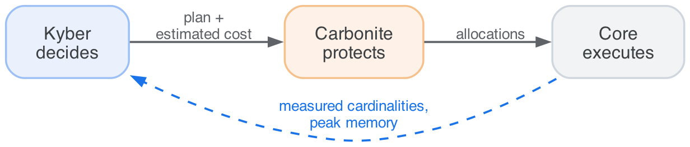

# Carbonite

Carbonite is the resource manager. It decides whether a plan is feasible, hands
out memory reservations and shuffle credits, and decides when a query must spill —
and it does nothing else. It never rewrites a plan (that is Kyber) and never
computes a result (that is the engine). Most users never call it directly; it runs
underneath every query to keep the engine inside its memory envelope instead of
running it out of memory.

Carbonite sits in the contract loop between the optimizer and the executor:



Kyber decides what to run and what it should cost. Carbonite decides whether that
fits, and protects against OOM and cascading failure. Core runs the plan and
reports what actually happened, which Kyber learns from on the next run.

## What it does

The `ResourceManager` is a thin orchestrator over four pluggable policies
(admission, spill, flow control, and memory estimation) plus the memory subsystem:
a buffer pool and a pressure monitor. Its job comes down to four decisions.
`validate(plan)` answers whether a plan is feasible; when it does not fit, the
verdict carries a counter-offer — a smaller credit window, a lower parallelism — for
Kyber to re-plan around, rather than a flat rejection. `reserve(bytes)` accounts an
allocation against the process-wide buffer pool with blocking semantics, so
concurrent operators cannot collectively overshoot the envelope. `should_spill(plan)`
compares a plan's estimated footprint against live memory, sending a query that will
not fit out-of-core instead of letting it die. And `grant_credits(requested)` hands a
shuffle channel its credit window, clamped so no single channel can starve the rest.

## Memory and spill

Carbonite manages one memory envelope and keeps the engine inside it. Allocations
throttle at the soft limit and the engine begins spilling to disk at the hard
limit; aggregation, join, and sort all have a spill path, so the failure mode of a
too-large query is *slower*, not *dead*.

| Knob (`config.memory`) | Default | Meaning |
|------------------------|---------|---------|
| `soft_limit` | `0.85` | Throttle new allocations at this fraction of the envelope. |
| `hard_limit` | `0.90` | Begin spilling to disk at this fraction. |
| `max_memory_bytes` | `None` | Hard cap in bytes. `None` runs fully in memory; set it to bound memory (honoring a container/cgroup limit) and enable out-of-core spilling. |

The envelope is derived from system RAM by default. In a container, the OS often
reports the host's memory rather than the cgroup limit, so set `max_memory_bytes`
to the real ceiling.

## Flow control

The shuffle uses credit-based backpressure: one credit is one in-flight
`RecordBatch` slot, so a channel's credit window is a direct bound on its memory. A
producer blocks when its credits reach zero. Carbonite is the authority that grants
the window and clamps any per-operator request to `default_credits ×
credit_ceiling_factor`.

| Knob (`config.flow_control`) | Default | Meaning |
|------------------------------|---------|---------|
| `default_credits` | `4` | In-flight batch slots when an operator has no estimate. |
| `credit_ceiling_factor` | `16` | Maximum window is `default_credits × this`. |
| `shuffle_fan_in` | `8` | Inbound streams a shuffle node fans in before the reduce becomes a tree of combiners. |
| `aimd_alpha` / `aimd_beta` | `1` / `0.5` | Additive increase per round trip; multiplicative decrease on congestion. |
| `backpressure_high` / `backpressure_low` | `0.70` / `0.40` | Buffer occupancy that throttles, then resumes, the producer. |

By default the credit window is the static grant above. Setting
`config.distributed.adaptive_credits` turns on a TCP-like AIMD controller that grows
and shrinks the window per remote fetch from observed backpressure. It is off by
default so the static path — and single-node-equals-distributed equivalence —
stays unchanged.

## Data transfer

On a cluster, bulk batches move over Arrow Flight (`bc-transport`), not through the
Ray object store. Which transport runs is one knob:

| `config.distributed.transport` | Behavior |
|--------------------------------|----------|
| `"auto"` (default) | Flight on a genuine multi-node cluster; Arrow-IPC disk files on one node or a shared filesystem. |
| `"flight"` | Force network shuffle. |
| `"disk"` | Force the disk shuffle (only safe when every worker shares a filesystem at the same path). |

The disk shuffle's working directory is driver-local, so `"auto"` will not pick it
across nodes unless you also set `config.distributed.shared_filesystem`.

## Tuning

Carbonite reads its knobs from `Config`. Derive a new config to change one:

```python
import dataclasses
from batcher import Config

base = Config()
cfg = base.replace(
    memory=dataclasses.replace(base.memory, hard_limit=0.95),
    flow_control=dataclasses.replace(base.flow_control, default_credits=8),
)
```

See [Configuration options](../configuration/options.md) for every field.

## See also

- [Kyber optimizer](kyber.md) — what Carbonite checks feasibility for
- [Execution engine](execution.md) — where reservations and spill happen
- [Configuration options](../configuration/options.md) — the memory and flow-control knobs
