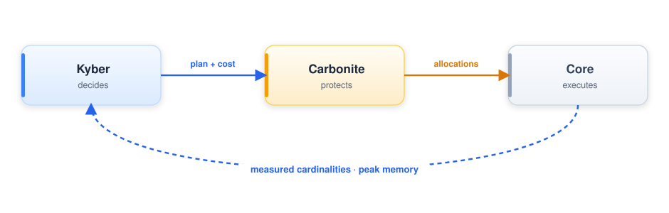

# Carbonite

Carbonite is the resource manager. It decides whether a plan is feasible, hands
out memory reservations and shuffle credits, and decides when a query must spill —
and it does nothing else. It never rewrites a plan (that is Kyber) and never
computes a result (that is the engine). Most users never call it directly; it runs
underneath every query to keep the engine inside its memory envelope instead of
running it out of memory.

Carbonite sits in the contract loop between the optimizer and the executor:



Kyber decides what to run and what it should cost. Carbonite decides whether that
fits, and protects against OOM and cascading failure. Core runs the plan and
reports what actually happened, which Kyber learns from on the next run.

## What it does

The `ResourceManager` is a thin orchestrator over four pluggable policies
(admission, spill, flow control, and memory estimation) plus the memory subsystem:
a buffer pool and a pressure monitor. Its job comes down to four decisions.
`validate(plan)` answers whether a plan is feasible; when it does not fit, the
verdict carries a counter-offer — a smaller credit window, a lower parallelism — for
Kyber to re-plan around, rather than a flat rejection. `reserve(bytes)` accounts an
allocation against the process-wide buffer pool with blocking semantics, so
concurrent operators cannot collectively overshoot the envelope. `should_spill(plan)`
compares a plan's estimated footprint against live memory, sending a query that will
not fit out-of-core instead of letting it die. And `grant_credits(requested)` hands a
shuffle channel its credit window, clamped so no single channel can starve the rest.

## Memory and spill

Carbonite manages one memory envelope and keeps the engine inside it. Allocations
throttle at the soft limit and the engine begins spilling to disk at the hard
limit; aggregation, join, and sort all have a spill path, so the failure mode of a
too-large query is *slower*, not *dead*.

| Knob (`config.memory`) | Default | Meaning |
|------------------------|---------|---------|
| `soft_limit` | `0.85` | Throttle new allocations at this fraction of the envelope. |
| `hard_limit` | `0.90` | Begin spilling to disk at this fraction. |
| `max_memory_bytes` | `None` | Hard cap in bytes. `None` runs fully in memory; set it to bound memory (honoring a container/cgroup limit) and enable out-of-core spilling. |

The envelope is derived from system RAM by default. In a container, the OS often
reports the host's memory rather than the cgroup limit, so set `max_memory_bytes`
to the real ceiling.

### Why a query went out of core

Two independent signals route a query to the spilling executor, and they call for
opposite responses. An estimate over budget is about the plan and is answered by
reshaping it; live memory pressure is about the box and is answered by finding what else
holds memory. `explain(analyze=True)` names which one fired:

```python
# docs: run
import batcher as bt

ds = bt.from_pydict({"k": [1, 2, 1, 2], "v": [10, 20, 30, 40]})
report = ds.group_by("k").agg(total=bt.col("v").sum()).explain(analyze=True)
print("[carbonite/resources]" in report)
```

```text
True
```

The report carries two Carbonite decisions. The admission decision names the operator
that binds the constraint, not just which resource ran out, so an infeasible plan points
at the join or aggregate to reshape. The resource decision, recorded after execution,
carries the envelope's peak utilization, the result cache's hit rate, and the pressure
level the query actually ran under, because the same plan is fast with headroom and slow
at the edge of the budget.

### Disk is governed too

Spilling trades memory pressure for disk pressure, and a full scratch volume is a hard
failure rather than a slow one: an out-of-space write cannot be retried or degraded. The
local tier is therefore classified on its own three-level ladder, measured rather than
accounted, so a volume filled by a co-tenant is seen as readily as one this query filled:

| Level | Meaning |
|-------|---------|
| `NORMAL` | Ample room; buckets stay on the fast local tier. |
| `ELEVATED` | Under a quarter free; new buckets route to `spill_remote_uri` if one is set. |
| `FULL` | Under the reserve floor; the local tier is exhausted. |

New buckets route away at `ELEVATED` rather than waiting for `FULL`, because a bucket's
tier is fixed when it opens: by the time the floor is crossed, several buckets can already
be streaming to a volume that cannot hold them. Set `memory.spill_remote_uri` to give them
somewhere to go. Without it the local tier is all there is, and a full disk fails the
query with a message naming the volume and the fix.

## Flow control

The shuffle uses credit-based backpressure: one credit is one in-flight
`RecordBatch` slot, so a channel's credit window is a direct bound on its memory. A
producer blocks when its credits reach zero. Carbonite is the authority that grants
the window and clamps any per-operator request to `default_credits ×
credit_ceiling_factor`.

| Knob (`config.flow_control`) | Default | Meaning |
|------------------------------|---------|---------|
| `default_credits` | `16` | In-flight batch slots when an operator has no estimate. |
| `credit_ceiling_factor` | `4` | Maximum window is `default_credits × this`. |
| `shuffle_fan_in` | `8` | Inbound streams a shuffle node fans in before the reduce becomes a tree of combiners. |
| `aimd_alpha` / `aimd_beta` | `1` / `0.5` | Additive increase per round trip; multiplicative decrease on congestion. |
| `backpressure_high` / `backpressure_low` | `0.70` / `0.40` | Buffer occupancy that throttles, then resumes, the producer. |

By default the credit window is the static grant above. Setting
`config.distributed.adaptive_credits` turns on a TCP-like AIMD controller that grows
and shrinks the window per remote fetch from observed backpressure. It is off by
default so the static path — and single-node-equals-distributed equivalence —
stays unchanged.

## Data transfer

On a cluster, bulk batches move over Arrow Flight (`bc-transport`), not through the
Ray object store. Which transport runs is one knob:

| `config.distributed.transport` | Behavior |
|--------------------------------|----------|
| `"auto"` (default) | Flight on a genuine multi-node cluster; Arrow-IPC disk files on one node or a shared filesystem. |
| `"flight"` | Force network shuffle. |
| `"disk"` | Force the disk shuffle (only safe when every worker shares a filesystem at the same path). |

The disk shuffle's working directory is driver-local, so `"auto"` will not pick it
across nodes unless you also set `config.distributed.shared_filesystem`.

### Published shuffle output is memory too

A shuffle bucket is the one large footprint the buffer pool used to miss. Nobody reserves
it. A mapper produces the bucket, hands it to the node's Flight store, and it stays
resident until a reducer collects it, so with as many mappers as reducers a node holds its
whole share of the shuffle in memory no reservation covers.

The store now takes a reservation equal to what it holds, against the same envelope every
operator draws on. When the pool cannot cover a growth, the store writes its largest
buckets to local disk and reads them back on fetch. The rows are unchanged, so the cost is
a re-read and nothing else, and a shuffle that fits the envelope never touches the disk.

That reservation also makes published output the first thing the pool asks to spill when
another operator cannot get memory. It is the right first victim: a published bucket is
finished work waiting to be collected, so spilling it stalls nobody, where spilling a
half-built hash table interrupts an operator that is still using it.

### Same-node zero-copy fast path (automatic)

Within a shuffle, a reducer's sources fall into three tiers, and Carbonite picks the
cheapest for each one with **no configuration** — it just works:

| Source | Path | Cost |
|--------|------|------|
| Same process | `DIRECT_MEMORY` — read straight from the local store | no copy, no socket |
| **Same node, different process** | `SHARED_MEMORY` — mmap a 64-byte-aligned Arrow IPC file, decoded **zero-copy** | ~a memcpy; **≈23× a loopback Flight hop** |
| Another node | `NETWORK` — credit-bounded Arrow Flight | one gRPC stream |

The common GPU-cluster shape packs several worker actors per node, so many of a
reducer's fetches are same-node-but-cross-process — exactly the tier the shared-memory
path accelerates. It is **on by default** (`config.distributed.shared_memory_transfer`)
and safe to leave on because it is:

- **Adaptive / self-limiting.** The mmap file is a second copy (in tmpfs = RAM) on top
  of the in-memory store Flight serves remote reducers from, so a mapper **skips** the
  mirror whenever the node is under memory pressure (`PressureLevel.SPILL`+). The reducer
  then falls back to Flight. On a churning spot node — where recompute transiently
  doubles live state — the fast path steps aside rather than risking OOM.
- **Concurrency-preserving.** Same-node buckets are read from shared memory *inside* the
  concurrent gather, so cross-node buckets still fan out in parallel — you get the 23× on
  the same-node fraction with no loss of cross-node throughput.
- **Result-preserving.** A shm miss (bucket not mirrored, another node, shm unavailable)
  transparently falls back to Flight, which is bit-identical, so single-node == distributed
  holds regardless.

Measured on a real cluster: a single-node multi-actor gather (8 producers → 1 reducer)
runs at **33.6 GB/s with shared memory vs 4.5 GB/s over loopback Flight** (7.5× through
the full concurrent gather; ~23× point-to-point).

### Cross-node throughput scales with the cluster

A single reducer's inbound rate is bounded by its NIC (~2.7 GB/s = ~22 Gbps on a T4
node, i.e. line rate); the 10× is in the **aggregate** all-to-all, where every node
reduces at once. Measured aggregate shuffle throughput: **2.0 → 6.9 → 15.2 GB/s at 2 → 4
→ 8 nodes** — it grows with the node count, because the mergeable `partial → combine →
finalize` algebra plus credit flow control keep per-node memory bounded no matter how
wide the cluster. The shuffle runtime's worker-thread pool is **auto-sized to the host's
cores** (clamped to keep concurrent-decode throughput near the NIC without
oversubscribing many-actor nodes); override with `BATCHER_SHUFFLE_RT_THREADS` only for an
unusual node shape.

## Self-tuning from measured metadata

The contract loop does not just protect the current query — it *learns* from it.
Core measures what every operator actually did (rows in/out, wall time, per-core CPU
busy fraction, and peak bytes) and records it into the `MetadataHub`; Carbonite then
sizes the next run against that measured reality instead of a cold plan estimate.
Every decision here is **result-invariant**: it changes how much memory a query
reserves, when it spills, and how big a morsel is — never what the query returns.
That invariance is property-tested (tuned run == untuned run), which is what lets
the sizing learn aggressively; the worst a stale learned value can do is cost
throughput.

### The learned memory model

Carbonite's headline learner is the `LearnedMemoryModel`. It closes a specific gap:
Core records each operator's *actual* peak memory (`m_peak_bytes`), but historically
every sizing decision — admission, spill, reservation, morsel — sized from Kyber's
plan estimate alone and never consulted what the operator really used. The model is
the memory analog of Kyber's cost calibration: from the measured peaks it fits a
per-operator-family **bytes-per-input-row** figure (a *ratio*, not an absolute peak,
so it is size-general — a 1M-row aggregate and a 10-row one share one coefficient),
and each sizing decision blends the plan's byte estimate toward that measured figure,
clamped so a noisy sample can never wildly move sizing.

That single blended peak feeds every memory decision through one `_peak_bytes(plan)`:
`should_spill` routes a query out-of-core when its *measured* footprint won't fit,
`recommend_spill_partitions` shards the spilled state so each bucket stays bounded,
`recommend_spill_compression` compresses a large IO-bound state, and admission and
`reserve` account against reality. Morsel sizing tightens too: the widest learned
per-row width caps the morsel row count so a workload of wide rows (large strings,
embeddings, blob handles) keeps its true byte working set within budget. On a cold
store the model is an empty pass-through — every method defers to the plan estimate,
so a first run is byte-for-byte the pre-learning behavior.

### Learned flow control

The credit machinery learns the same way. `grant_credits(signature=…)` warm-starts a
recurring shuffle channel from the window past runs of that shape converged on (a
learned credit window), rather than the static `default_credits`. The AIMD controller
still governs the window actually used from live backpressure — with hysteresis
between `backpressure_high` and `backpressure_low` so a channel does not oscillate —
so learning only moves the *starting point*; the converged window is persisted back
after the run to seed the next one. Single-node-equals-distributed equivalence is
untouched, because a credit window only bounds in-flight batches, never the result.

### The sibling tuning layers

Carbonite owns the memory and resource half of a larger, coherent self-tuning system;
the other halves live in their own subsystems and are wired together by `api`:

- **Kyber — `learned_tuning`** picks *physical strategy* from measured runs: a UCB1
  bandit over equivalent join algorithms (hash / broadcast / sort-merge), learned
  broadcast-byte and sort-merge-row thresholds (an OLS line crossover), learned
  build-side and partition priors, and whether partial pre-aggregation pays off — see
  [Kyber optimizer](kyber.md).
- **Core / Dist — `adaptive_sizing`** tunes *distributed scheduling*: learned
  UDF/inference actor-pool size, GPU batch caps, source partition count, per-task CPU
  share, shuffle reducer fan-out, and straggler-speculation aggressiveness — each a
  pure scheduling knob under the mergeable algebra.
- **`api` — `tuning`** is the conductor half: it *activates* the read-side decisions
  each subsystem exposes and *records* the measured outcomes back, closing every
  feedback loop (join bandit, group-reduction, converged credit window) so the
  learning actually accrues — see the adaptive re-optimization loop in
  [Execution engine](execution.md).

All of them share the one rule above: they tune performance and scheduling, and a
cold `MetadataHub` reproduces the untuned behavior exactly.

## Tuning

Carbonite reads its knobs from `Config`. Derive a new config to change one:

```python
import dataclasses
from batcher import Config

base = Config()
cfg = base.replace(
    memory=dataclasses.replace(base.memory, hard_limit=0.95),
    flow_control=dataclasses.replace(base.flow_control, default_credits=8),
)
```

See [Configuration options](../configuration/options.md) for every field.

## See also

- [Kyber optimizer](kyber.md) — what Carbonite checks feasibility for
- [Execution engine](execution.md) — where reservations and spill happen
- [Configuration options](../configuration/options.md) — the memory and flow-control knobs
