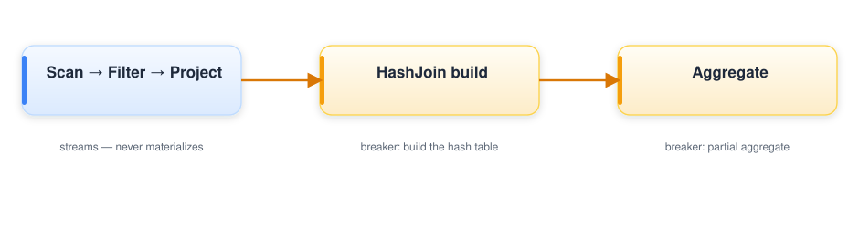

# Execution engine

Once Kyber has optimized a plan, the execution engine runs it. The Python side
(`core`) does no per-row work: it lowers the physical plan to JSON IR, hands it to
the Rust data plane through one FFI call, and gets Arrow batches back. Everything
that touches a row happens in Rust.

```python
out, metrics = _native.execute_plan_metered(plan.to_json(), sources, cfg.engine_config_json())
```

The plan crosses the boundary as JSON; the data crosses as zero-copy Arrow
`RecordBatch`es (the Arrow C Data Interface). Nothing else moves between the two
languages.

## Pipelines and breakers

The engine lowers a plan into pipelines. A pipeline is a maximal chain of
operators that can run a batch straight through without materializing —
scan, filter, project, probe. A breaker is an operator that has to collect its
input before it can produce output: a hash-table build, an aggregate, a sort, a
distinct, a window. Breakers are where data materializes, where the engine spills
under memory pressure, where a distributed query shuffles, and where the adaptive
layer re-plans.



The unit of work inside a pipeline is the morsel — a `RecordBatch` of 16,384 rows
by default (`execution.morsel_rows`). Morsels keep scheduling granular and the
working set in cache.

## Execution tiers

There is one set of operator semantics, exercised by three execution paths. The
sequential interpreter is the oracle; the other two must agree with it.

- **Tier-0 sequential** (`bc-interp`, `execute`) is the reference. It is simple,
  deterministic, and obviously correct, and every other path is tested against it.
- **Tier-0 parallel** (`bc-interp::par`) reuses the same operator code and changes
  only the scheduling: morselize, run on a rayon thread pool, and hash-shuffle into
  the breakers. It computes exactly what the sequential path does.
- **Tier-1 JIT** (`bc-codegen`) compiles the supported subset of column
  expressions to machine code with Cranelift — once per operator, reused across
  every morsel. On anything it does not support it falls back to the interpreter
  rather than diverge. The JIT is bit-for-bit identical to the interpreter on its
  subset.

A query can drop from a compiled pipeline back to the interpreter at any breaker.
That is what lets adaptivity and compilation coexist: an artifact can be thrown
away and the relational state, which lives in the runtime library rather than in
generated code, survives.

## One algebra, single node to cluster

Stateful operators are written once in `bc-runtime` as mergeable primitives:
`partial(batch) → state`, `combine(states) → state`, `finalize(state) → rows`,
with `combine` associative and commutative. That single implementation serves
every scale:

- one core — the sequential interpreter;
- many cores — `bc-interp::par` morselizes, builds partials in parallel, and
  combines them;
- many machines — `bc-interp::dist` composes the same `partial / combine /
  finalize` across Ray workers.

Because the distributed path is the same algebra, a result is identical whether it
runs on one node or a hundred. There is no second distributed operator with its own
semantics. CI asserts this directly: single-node output must equal multi-worker
output for every stateful operator.

## Distribution

Ray is an optional dependency, and single-node execution never loads it. When a
query does distribute, Ray schedules tasks and actors and carries control-plane
metadata — but the bulk data does not travel through the Ray object store. Each
worker hosts the same in-process Rust engine, and batches move between workers over
Arrow Flight (`bc-transport`) with credit-based flow control: one credit is one
in-flight batch slot, and a producer blocks when its credits reach zero. The same
radix-partition-and-spill machinery that does single-node out-of-core becomes the
distributed shuffle — disk and network are just two sinks for the same mechanism.

## Adaptive re-optimization

This is the part static engines cannot match. At a pipeline breaker the engine has
*measured* the data it just processed — real row counts, real operator times, real
peak memory — not estimated them. Core records those into the MetadataHub, and when
an estimate was wrong by more than `optimizer.reoptimize_error` (default 2×), Kyber
re-plans the rest of the query on the measured numbers. DuckDB optimizes once before
it runs; Spark AQE adapts only at stage boundaries; Batcher adapts at every breaker.

## Memory and spill

Carbonite owns the memory envelope. It throttles new allocations at
`memory.soft_limit` (0.85 of the budget) and begins spilling to disk at
`memory.hard_limit` (0.90). Aggregation, join, and sort all spill, so a query that
does not fit in memory slows down rather than failing. None of this requires a
different plan — spilling is a property of the runtime primitive, not a separate
operator.

## Answering from metadata (no scan)

The fastest execution is none at all. Before a terminal runs the engine, the
conductor asks Kyber whether the answer is *provably* derivable from the sources'
declared statistics — a Parquet/ORC footer, a lakehouse manifest, a SQL catalog —
which the IO layer already opens for schema and split planning. When it is, the
terminal returns the answer without touching a row.

The layer covers the terminals whose result a footer can carry:

- `count()` / `is_empty()` — from the relation's exact row count (an ORC `nrows`, a
  summed Parquet footer), through row-preserving projections, and across the
  mergeable operators that keep an exact count (an empty-side join, `limit(0)`, a
  UNION of exact counts).
- Global (keyless) aggregates — `min` / `max` from footer bounds, `count(*)`,
  `count(col)` from `rows − null_count`, `sum` from a catalog's recorded total,
  `n_unique` / `count_distinct` from an exact distinct count, and `bool_and` /
  `bool_or` from a boolean column's exact min/max.
- Per-column existence and null facets — `null_count`, `has_nulls`, `all_null`.
- Filtered counts — `WHERE col IS NULL` is exactly the recorded null count,
  `col IS NOT NULL` is `rows − null_count`, and a provably out-of-range predicate
  (`col > max`, `col = v` outside `[min, max]` or absent from the column's
  membership bloom) is exactly `0`. A predicate that only *partially* overlaps the
  column's range needs a histogram, so it is **not** answered — it falls back.
- `describe()` / `summary()` — a per-column snapshot assembled from whichever
  facets are exact, omitting the rest so the caller runs the real describe for what
  is missing.
- A provably-empty plan — `_collect` short-circuits a contradiction filter,
  `limit(0)`, an always-false predicate, or an empty-side join to a correct-schema,
  zero-row table with no scan.

### The firewall: exact or fall back

A wrong metadata answer is not a slow query — it is *silent corruption*. So the
whole layer is gated on one rule: an exact answer is produced only from statistics
that are `Provenance.EXACT` **end to end**. Footer min/max (on numeric, temporal,
boolean, and decimal columns), null counts, and exact row counts are EXACT; a
byte-truncated string bound, a filtered/limited column (whose min/max survive only
as *bounds*), a sketch-derived distinct count, and a learned prior are **not**. An
inexact statistic never answers an exact terminal — it may only inform cost or back
an explicitly-named `approx_*` terminal (`approx_n_unique`, an approximate
quantile). Provenance can only ever be *weakened* as stats propagate through the
plan (via the single `weakest`/`downgrade` combiner), so nothing can silently
over-claim, and every shortcut returns `None` — meaning "execute normally" — the
moment it cannot prove exactness. A metadata answer is therefore an optimization
that can never change a result.

This is proven, not asserted: property tests generate random data and assert the
metadata answer equals the executed answer equals DuckDB across the covered
terminals. One correctness fix the discipline caught: Parquet's `distinct_count` is
only an *estimate*, but it had been tagged EXACT — which would have let it answer an
exact `count_distinct` wrongly. It is now `SKETCH`, kept only on already-inexact
columns to inform cost and `approx_count_distinct`.

```python
# docs: run
import batcher as bt

ds = bt.from_pydict({"x": [1, 2, 3, 4, 5]})
# Answered from the source's exact row count — no scan.
assert ds.count() == 5
# Provably empty: the predicate is out of range, so is_empty() short-circuits.
assert ds.filter(bt.col("x") > 100).is_empty()
```

## Running a query

Execution is lazy. Operations build a plan; nothing runs until a terminal call.

```python
import batcher as bt

ds = bt.read("events.parquet")
result = (
    ds.filter(bt.col("status") == "active")
    .group_by("category")
    .agg(n=bt.count())
    .collect()
)
```

The terminal operations are `collect()`, `to_pydict()`, `count()`, `write...`, and
`iter_batches()` for streaming a result without materializing it whole. To see the
plan the engine will run, without running it, use `explain()`:

```python
print(ds.filter(bt.col("x") > 10).select("a", "b").explain())
```

## Tuning

The knobs that shape execution live on `config.execution` and
`config.flow_control` (see [Configuration options](../configuration/options.md)
for the full reference). The two that matter most:

```python
import dataclasses
from batcher import Config

base = Config()
cfg = base.replace(
    execution=dataclasses.replace(base.execution, morsel_rows=8192, parallelism=8),
)
```

`morsel_rows` sets the scheduling granularity; `parallelism` sets the worker-thread
count (`0` uses every core). Both are shipped to the Rust data plane so the Python
and Rust sides never disagree.

## See also

- [Kyber optimizer](kyber.md) — query planning and the re-optimization loop
- [Carbonite](carbonite.md) — memory, spill, and flow control
- [Configuration options](../configuration/options.md) — every execution knob
