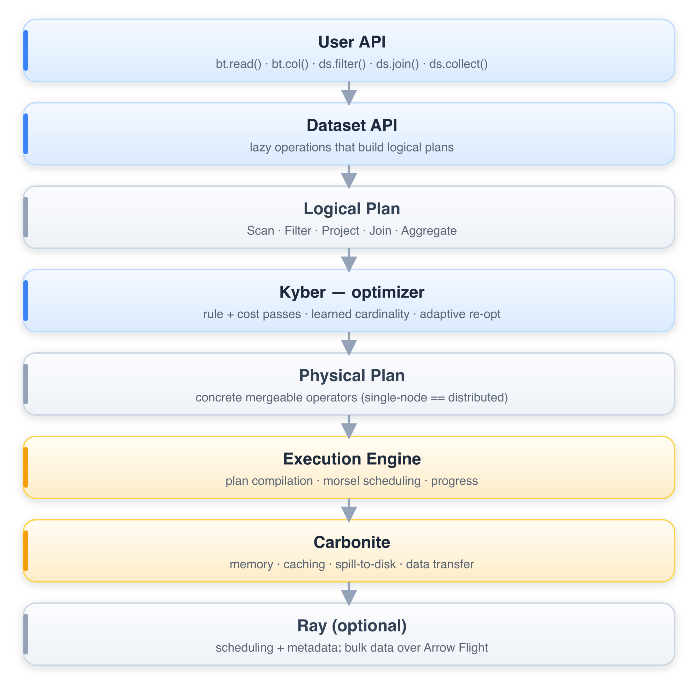
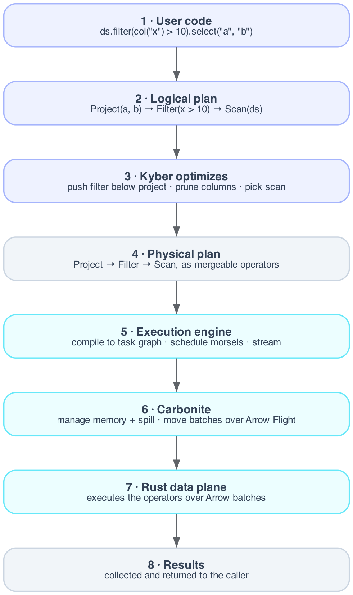

# Internals

How Batcher works under the hood: the layered architecture and the components that
turn your query into results. You don't need any of this to use Batcher — it's here
for contributors and the curious.

## Architecture overview



Ray is an optional dependency used only for distributed scheduling. Single-node
execution does not require it, and even on a cluster the data plane moves Arrow
batches over Arrow Flight rather than through the Ray object store.

## Core components

### Kyber optimizer

Kyber is Batcher's query optimization engine. It transforms logical plans into efficient physical plans through:

- **Phased rule pipeline** (normalize → pushdown → join-reorder → fusion →
  selection → enforce), with rules grouped by family in `kyber/rules/`
- **Cost-based physical choices**: join build-side swap and hash-vs-broadcast
  selection from sketch/learned cardinality
- **Learned cardinality** that sharpens across runs via the MetadataHub
- **Intra-query adaptive re-optimization** - re-plans at pipeline breakers on
  *measured* sizes, single-node and distributed (the moat over DuckDB/Spark AQE)

[Learn more about Kyber](kyber.md)

### Carbonite

Carbonite handles memory management and data movement:

- **Memory coordination** across the cluster
- **File-based caching** for intermediate results
- **Spill-to-disk** when memory is constrained
- **Shuffle optimization** for redistributing data
- **Backpressure control** for streaming execution

[Learn more about Carbonite](carbonite.md)

### Execution engine

The execution engine runs the optimized plan in Rust over Arrow batches. It lowers
the plan into pipelines and breakers, schedules the work as 16K-row morsels, and
runs each pipeline through one of three paths that share operator semantics: the
sequential interpreter (the oracle), a rayon-parallel path, and a Cranelift JIT that
falls back to the interpreter on anything it does not support. The same mergeable
primitives run on one core, many cores, or many machines.

[Learn more about the execution engine](execution.md)

## Data flow

A typical query flows through the system:



## Key concepts

### Lazy evaluation

Operations build a plan without executing:

```python
# No execution yet - just building plan
ds2 = ds.filter(col("x") > 10)
ds3 = ds2.select("a", "b")

# Execution happens here
result = ds3.collect()
```

### Streaming execution

Data flows through operators in chunks:

```python
# Data streams through pipeline
# Memory footprint stays constant
for batch in ds.iter_batches():
    process(batch)
```

### Adaptive optimization

Kyber learns from execution feedback:

1. Initial plan uses statistics-based estimates
2. Execution reports actual row counts, timing
3. Kyber updates models for future queries

## Performance

### Optimization impact

| Optimization | Typical speedup |
|--------------|-----------------|
| Predicate pushdown | 2-10x |
| Projection pruning | 1.5-3x |
| Join reordering | 2-100x |
| Operator fusion | 1.2-2x |

### Scalability

Batcher's distributed path composes the *same* mergeable primitives
(`partial → combine → finalize`) the single-node path uses, so per-node memory
stays bounded and the shuffle is credit-controlled (data bypasses the Ray object
store via Arrow Flight). This is the design basis for near-linear scaling, but
**published multi-node throughput numbers are not yet measured** - distributed
execution is validated for *correctness* (single-node == multi-worker equivalence)
in CI; large-cluster benchmarks are pending real multi-host runs. We don't quote a
GB/s-per-node figure until the benchmark harness produces one.

## In this section

```{toctree}
:maxdepth: 1

kyber
carbonite
execution
extending
testing-strategy
```

The formal treatment (cost models, sketch error bounds, control-theory stability
proofs) lives in `internals/mathematical_foundations.md`, which is rendered to PDF
by `internals/generate_pdf.py` rather than as a site page.

## See also

- [Architecture overview](../architecture/overview.md): high-level design
